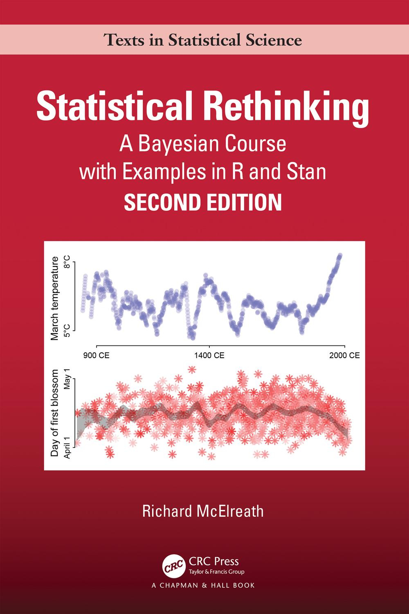
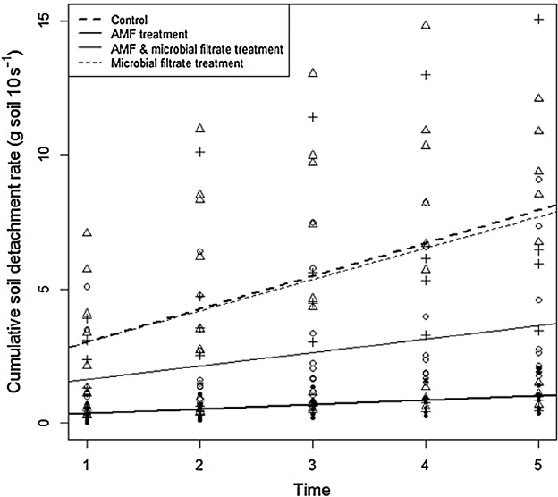
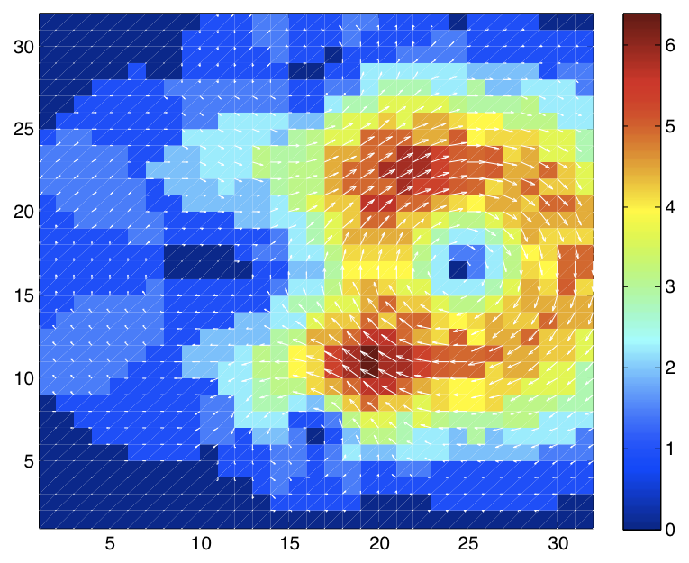
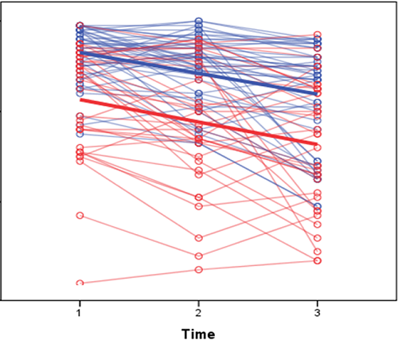
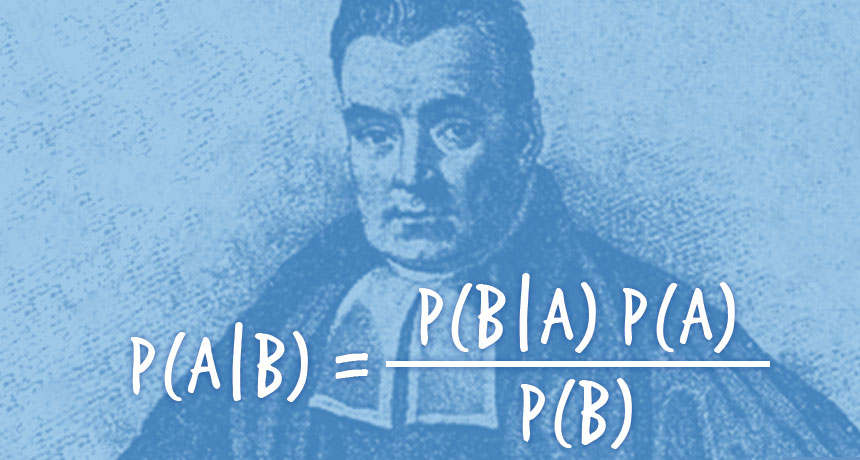
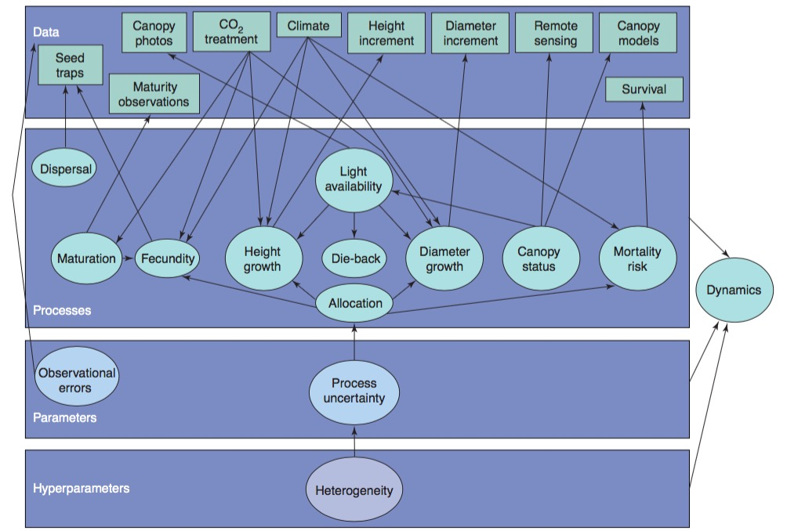

## {data-background="images/01/gorgeous-wildflowers-37110-37953-hd-wallpapers.jpg"}

<br><br><center><div style="font-size: 2em;font-weight: bold; color:black;background-color:white;opacity:0.8;"> Advanced Data Analysis for Biology</div>  
  
  
<div style="background-color:white;font-size:1em;opacity:0.8;">Jarrett Byrnes  
UMass Boston  
https://biol609.github.io/</span></center>

```{r prep, echo=FALSE, cache=FALSE, message=FALSE, warning=FALSE}
library(knitr)
opts_chunk$set(fig.height=4.5, comment=NA, 
               warning=FALSE, message=FALSE, 
               dev="jpeg", echo=FALSE)
library(tidyverse)
library(ggplot2)
```


## First, SomeNew Technology
https://etherpad.wikimedia.org/p/609-intro

- This class will use collaborative note-taking

- Research shows that this enhances learning!

- It's also a way to ask me a question during class

## Second, Some Old Technology
{width="30%"}

> - Green: Party on, Wayne 
> - Red: I fell off the understanding wagon  
> - Blue: Write a question/Other


## Outline for Today
1. Who are you?  
  
2. How will this course work?   
  
3. What are we doing here?  
  
4. Review of generalized linear modeling techniques so far 

## Who are You?
1. Name  

2. Lab  

3. Brief research description  

4. Why are you here?  

## Outline for Today
1. Who are you?  
  
2. **How will this course work?**   
  
3. What are we doing here?  
  
4. Review of generalized linear modeling techniques so far 

## Lecture and Lab
 - 1 Hour Lecutre on Concepts with code
 - 1/2 Hour work on problem
 - Occasional Paper/Chapter Discussion
 

## Lectures are Coded
R Markdown sometimes with Reveal.js
&nbsp;  
<center></center>
http://github.com/biol609/biol609.github.io


## The Book: Statistical Rethinking
{width="40%"}

## Monthly Problem Sets
1. 2-3 Problems covering topics from the month  
  
2. We will go over them in 1/2 hour of the next class, self-graded

## Final Paper
<br><br><br>
<h3>Do your research</h3>
(but be statsy about it)

## Extra Credit 1: Be Me
- I have a few meetings this semester  
  
- Will have some guest lectures
  
- BUT - you can be that guest lecturer

## Extra Credit 2: Livin' La Vida Data Science
|                       |                       |
|-----------------------|-----------------------|
|||

## Extra Credit 3: Data Science for Social Good


http://www.meetup.com/Data-Science-for-Social-Good/

## Extra Credit 4: Stats Lunch
<h3>Tuesdays 12-1 in M-2-628</h3>  
  
It's mostly psychologists, so let's start interacting!

## Outline for Today
1. Who are you?  
  
2. How will this course work?   
  
3. **What are we doing here?**  
  
4. Review of generalized linear modeling techniques so far 


## Model-A-Palooza
  
**Objective 1)**	To learn how to think about your study system and research question of interest in a systematic way and match it with a realistic process-based model.

## Enter The Reverend
  
**Objective 2)**	To understand how to build and fit hierarchical/multilevel models in a likelihood and Bayesian framework.

## The Rest of Your Life

**Objective 3)**	Provide the grounding needed to effectively collaborate with statistical experts.  
  
**Objective 4)**	Allow students to gain the knowledge necessary to become life-long learners of data analysis techniques, able to incorporate new techniques into their analytic toolbelt as needed.

## Modeling So Far: General Linear Models
$$\boldsymbol{Y} = \boldsymbol{b X} + \boldsymbol{\epsilon}$$

```{r iris_plot}
ggplot(iris, mapping=aes(y=Sepal.Width, x=Sepal.Length, color=Species)) +
  geom_point() +
  stat_smooth(method="lm") +
  theme_bw(base_size=17)
```

## Foundational Modeling Approach

1. What is your data generating process?  
  
2. What is your error generating process?

## Philosophical Approach

> - **Frequentist Inference:** Correct conclusion drawn from repeated experiments  
>     - Uses p-values and CIs as inferential engine  
\
> - **Likelihoodist/Information Theoretic Inference:** Evaluate the weight of evidence for different hypotheses  
>     - Derivative of frequentist mode of thinking  
>     - Uses model comparison (sometimes with p-values...)  
\
> - **Bayesian Inference:** Probability of belief that is constantly updated  
>     - Uses explicit statements of probability and degree of belief for inferences  


## Two Foci of the Course
  
1.  Funky Error Structures 
  
2. Bayesian Inference and the Freedom it Brings for Process-Based Models

## Heterogeneous Error Structure


## Spatial Autocorrelation
{width="70%"}

## Temporal Autocorrelation


## Mixed Models


## Mixed Models


## Zero Inflated Models
```{r z}
a <- rpois(300, 5)
a <- c(a, rep(0,200))
hist(a)
```

## Deep Dives into Bayes


## Process Models
{width="80%"}

## Outline for Today
1. Who are you?  
  
2. How will this course work?  
  
3. What are we doing here?  
  
4. **Review of generalized linear modeling techniques so far **

## The General Linear Model

$$\Large \boldsymbol{Y} = \boldsymbol{\beta X} + \boldsymbol{\epsilon} $$ 
$$\Large \epsilon \sim \mathcal{N}(0,\sigma^{2})$$
  
  
-   This equation is huge. X can be anything - categorical,
    continuous, squared, sine, etc.

-   There can be straight additivity, or interactions


## General Linear Models

1.   Simple Linear Regresion  
  
2.   ANOVA

3.   ANCOVA

4.   Multiple Linear Regression

5.   MLR with Interactions

## Simple Linear Regression
$$y_{i} = \beta_{0} + \beta_{1}x_{i} + \epsilon_{i}$$ 
$$\epsilon \sim \mathcal{N}(0,\sigma^{2})$$

```{r iris_plot_lm}
ggplot(iris, mapping=aes(y=Sepal.Width, x=Sepal.Length)) +
  geom_point() +
  stat_smooth(method="lm") +
  theme_bw(base_size=17)
```

## Multiple Linear Regression
$$y_{i} = \beta_{0} + \sum^{k}_{j=0}\beta_{j}x_{ij} + \epsilon_{i}$$ 

```{r iris_plot_mlm}
i_mlr <- lm(Sepal.Width ~ Sepal.Length+Petal.Width, data=iris)
par(mfrow=c(1,2))
visreg::visreg(i_mlr)
par(mfrow=c(1,1))
```

## Categorical Predictors and ANOVA
$$y_{ij} = \beta_{0} + \sum \beta_{j}x_{ij} + \epsilon_{j}, \qquad x_{i} = 0,1$$  

```{r iris_plot_anova}
ggplot(iris, mapping=aes(y=Sepal.Width, x=Species, fill=Species)) +
  geom_boxplot() +
  theme_bw(base_size=17)
```

## Interactions and Mixing Categorical and Continuous Predictors
```{r iris_plot}
```


## Generalized Linear Models
$$\boldsymbol{\eta} = \boldsymbol{\beta X}$$ 
\
$$f(\boldsymbol{\hat{Y}}) = \boldsymbol{\eta}$$ \

f(y) is called the **link** function  
\
$$\boldsymbol{Y} = E(\boldsymbol{\hat{Y}}, \theta)$$ 
\
E is any distribution from the Exponential Family\
$\theta$ is an error parameter, and can be a function of Y

## GLMs: Link Functions

Basic Premise:

1.  <span>We have a linear predictor, $\eta_i = a+Bx$</span>\
    \

2.  That predictor is linked to the fitted value of $Y_i$, $\mu_i$\
    \

3.  We call this a link function, such that $g(\mu_i) = \eta_i$\

    -   For example, for a linear function, $\mu_i = \eta_i$\

    -   For an exponential function, $log(\mu_i) = \eta_i$


## Some Common Links

-   Identity: $\mu = \eta$, e.g. $\mu = a + bx$

-   Log: $log(\mu) = \eta$, e.g. $\mu = e^{a + bx}$

-   Logit: $logit(\mu) = \eta$, e.g.
    $\mu = \frac{e^{a + bx}}{1+e^{a + bx}}$

-   Inverse: $\frac{1}{\mu} = \eta$, e.g. $\mu = (a + bx)^{-1}$


## GLMs: Error

Basic Premise:

1.  <span>The error distribution is from the <span>*exponential*</span>
    family</span>

    -   e.g., Normal, Poisson, Binomial, and more.

    \
    \

2.  For these distributions, the variance is a funciton of the fitted
    value on the curve: $var(Y_i) = \theta V(\mu_i)$

    -   For a normal distribution, $var(\mu_i) = \theta*1$ as
        $V(\mu_i)=1$\

    -   For a poisson distribution, $var(\mu_i) = 1*\mu_i$ as
        $V(\mu_i)=\mu_i$


## Distributions, Canonical Links, and Dispersion

|Distribution | Canonical Link | Variance Function|
|-------------|-------------|-------------|
|Normal | identity | $\theta$|
|Poisson | log | $\mu$|
|Quasipoisson | log | $\mu\theta$|
|Binomial | logit | $\mu(1-\mu)$|
|Quasibinomial | logit | $\mu(1-\mu)\theta$|
|Negative Binomial | log | $\mu + \kappa\mu^2$|
|Gamma | inverse | $\mu^2$|
|Inverse Normal | $1/\mu^2$ | $\mu^3$|


## GLMs in Practice
```{r iris_plot_glm}
ggplot(iris, mapping=aes(y=Sepal.Width, x=Sepal.Length, color=Species)) +
  geom_point() +
  stat_smooth(method="glm", method.args=list(family=Gamma(link="log"))) +
  theme_bw(base_size=17)
```
