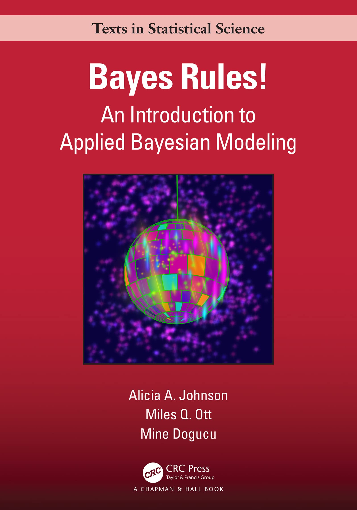

## {data-background="images/01/bayesian-2048x685.png" data-background-size="cover"}

<br><br><center><div style="font-size: 2em;font-weight: bold; color:black;background-color:white;opacity:0.8;"> Advanced Data Analysis for Biology</div>  
  
  
<div style="background-color:white;font-size:1em;opacity:0.8;">Jarrett Byrnes  
UMass Boston  
https://biol609.github.io/</span></center>

```{r prep, echo=FALSE, cache=FALSE, message=FALSE, warning=FALSE}
library(knitr)
opts_chunk$set(fig.height=4.5, comment=NA, 
               warning=FALSE, message=FALSE, 
               dev="jpeg", echo=FALSE)
library(tidyverse)
library(ggplot2)
```


## Outline for Today
1. Who are you?  
  
2. How will this course work?   
  
3. What are we doing here?  
  
4. Rethinking everything 

## Who are You?
1. Name  

2. Lab  

3. Brief research description  

4. Why are you here?  

## Outline for Today
1. Who are you?  
  
2. **How will this course work?**   
  
3. What are we doing here?  
  
4. Rethinking everything 

## Etherpads are Where it's at!
https://etherpad.wikimedia.org/p/609-intro-2024

- To share polls and code

- Can use for collaborative note-taking

- Research shows that this enhances learning!

- It's also a way to ask me a question during class

## Second, Some Old Technology
{width="30%"}

> - Green: Party on, Wayne 
> - Red: I fell off the understanding wagon  
> - Yellow: Slow down, Mister Teacher  
> - Blue: Write a question/Other


## What Are We Covering?
<br><br><br>
<center><h3>You tell me!<br> 
https://etherpad.wikimedia.org/p/609-intro-2024</h3></center>

## How will this work?
<br><br><br>
<center><h3>You tell me!<br> 
https://etherpad.wikimedia.org/p/609-intro-2024</h3></center>

 

## Lectures are Coded
R Markdown sometimes with Reveal.js or Xaringan
&nbsp;  
<center></center>
http://github.com/biol609/biol609.github.io

## Interact via Slack


- Join the #Biol609 channel
     * https://umbrug.slack.com/ <br> \    


## The Book: Statistical Rethinking 2nd Edition
{width="40%"}
## Some Scaffolding Reading
{width="40%"}

## Before Every Class
**The Questions I Will Ask About Readings at Random**
- What did you not get? (Don't be shy!) (This might be all we talk about). 
  
- What blew your mind?  
  
- How do you apply this to your own work?

## Final Paper
<br><br><br>
<h3>Do your research</h3>
(but be Bayesian about it)


## Outline for Today
1. Who are you?  
  
2. How will this course work?   
  
3. **What are we doing here?**  
  
4. Rethinking everything 


## Model-A-Palooza
  
**Objective 1)**	To learn how to think about your study system and research question of interest in a systematic way and match it with a realistic process-based model.

## Enter The Reverend
  
**Objective 2)**	To understand how to build and fit complex models in a Bayesian framework.

## The Rest of Your Life

**Objective 3)**	Provide the grounding needed to effectively collaborate with statistical experts.  
  
**Objective 4)**	Allow students to gain the knowledge necessary to become life-long learners of data analysis techniques, able to incorporate new techniques into their analytic toolbelt as needed.


## My True Goal in this Class

```{r tiktok}
library(tiktokrmd)

tt_url <- "https://www.tiktok.com/@juliaprogramming/video/7075431028772343086?q=bayesian&t=1706028065333"
tt <- tiktok_embed(tt_url)

tiktok_html(tt, include_player = TRUE)


```


## Outline for Today
1. Who are you?  
  
2. How will this course work?   
  
3. **What are we doing here?**  
  
4. Rethinking everything 

## Outline for Today
1. Who are you?  
  
2. How will this course work?  
  
3. What are we doing here?  
  
4. **Rethinking everything** 

## How do You View Data Analysis?

<center><h3>You tell me!<br> 
https://etherpad.wikimedia.org/p/609-intro-2024</h3></center>

## A Common Way to Think about Data Analysis

<div class = "fragment">NO!</div>

## One Hypothesis ≠ One Statistical Model


<div class = "fragment">Apply this to your research!</div>

## Back to Bayes-ics


## Bayesian Inference

{width="40%"}\

<font size="6">

-   Estimate probability of a parameter

-   State degree of believe in specific parameter values

-   Evaluate probability of hypothesis given the data

-   Incorporate prior knowledge

</font>

##
<h1>
> - Frequentist: p(x &le; D &#x7c; H)  
\
\
> - Likelihood-ist: p( D &#x7c; H)  
\
\
> -  Bayesian: p(H &#x7c; D)

</h1>

<div class = "fragment">What is the difference between these?</div>


## Let's see how Bayes works
\
I have a bag with 6 stones. Some are black. Some are white.  
\
I'm going to draw stones, one at a time, with replacement, and let's see the number of ways that the draw could have been produced.  
\
After 4 draws, let's calculate the probability of W white stones and B black stones. Let's formalize how we made this calculation. This leads to conditional versus marginal probabilities.  
\

## Let's see how Bayes works...
Now, I will look at the stones, and introduce a prior or some sort for W.  
\
Let's do a new set of draws, but this time, on the board, update our posterior.  
\
And finally, relate this to the definition of Bayes theorem in 2.3.4 pg 36.  

## Let's do this in R with Grid Sampling!  

Use `dplyr` and mutate for the following.   
  
0. Chose what fraction of stones is white in a bag of infinite size.  
\
1. Creat a column of possible values from 0 to 1.  
\
2. Define a prior as the second column.  
\
3. Calculate your posterior after 1 random draw, then repeat for draws 2-4 plotting your posteriors    
      * posterior = likelihood*prior/sum(all posterior values)  
\
4. Plot your posterior given 100 draws, given your initial prior. 

## Introducing rethinking  
This is from the Rcode on page 42, box 2.6. Assume 100 draws.  
\
```{r rethinking, eval=FALSE, echo = TRUE}
library(rethinking)

#alist is a list for used to define a model
draws_mod <- alist(
  
  #our likelihood
  w ~ dbinom(100, p)
  
  #our prior - can be something else if you want!
  p ~ dunif(0,1)
)

#define the data - you fill in the probability
draws_data <- list(w = XXX)

#We will use map - maximum a posteriori sampling
#Note, I use rethinking:: in case you've loaded purrr
draws_fit <- rethinking::map(draws_mod,
                             data = draws_data)
```

## Now let's explore our output
```{r explore, eval=FALSE, echo = TRUE}
draws_fit

summary(draws_fit)
```
