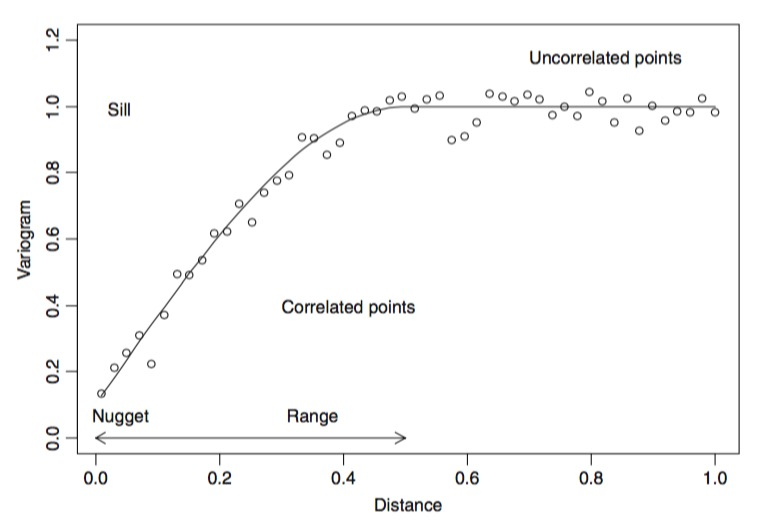

---
title:
css: style.css
output:
  revealjs::revealjs_presentation:
    reveal_options:
      slideNumber: true
      previewLinks: true
    theme: white
    center: false
    transition: fade
    self_contained: false
    lib_dir: libs
---
  
## 

<h3>Spatial Autocorrelation with GLS</h3>


  ```{r prep, echo=FALSE, cache=FALSE, message=FALSE, warning=FALSE}
library(knitr)
opts_chunk$set(fig.height=5, fig.width=7, comment=NA, 
               warning=FALSE, message=FALSE, 
               dev="jpeg", echo=FALSE)

library(ggplot2)
library(car)

library(dplyr)
library(tidyr)
library(broom)

library(nlme)
```

## Much of our data is spatial
```{r read_boreal}
boreal <- read.table("./data/06/Boreality.txt", header=T)
```
```{r plot_boreal_raw}

raw_boreal <- qplot(x, y, data=boreal, size=Wet, color=NDVI) +
  theme_bw() + 
  scale_size_continuous("Index of Wetness", range=c(0,7)) + 
  scale_color_gradient("NDVI", low="lightgreen", high="darkgreen")

raw_boreal
```

## Initial Non-Spatial Model
\
\
```{r bor_gls, echo=TRUE}
bor_gls <- gls(NDVI ~ Wet, 
               data=boreal)
```
## Spatial Autocorrelation in Residuals Can Be Clear

```{r boreal_bad}
## @knitr boreal_gls
bor_gls <- gls(NDVI ~ Wet, data=boreal)

## @knitr boreal_gls_residualPlot
qplot(x, y, data=boreal, size=abs(residuals(bor_gls, type="normalized")), color=factor((residuals(bor_gls)>0))) +
  theme_bw() + scale_size_continuous("Absolute Value of Residual", range=c(0,5)) + scale_color_discrete("Residual > 0?")
```

## How do we assess spatial autocorrelation: Variograms
```{r boreal_variogram}
plot(Variogram(bor_gls, form=~x+y, robust=T, maxDist=2000, resType="normalized"))
```

## How do we diagnose spatial autocorrelation
1. Moran's I  
    - Quantitative measure of spatial autocorrelation
    - Can use it to correct SE  
\
2. Variograms
    - Show nature of autocorrelation  
    - Show how to adjust correlation matrix in GLS

## Spatial Dependence
$$\gamma(x_1, x_2) = \frac{1}{2}\bar{(Z(x_1) - Z(x_2))^2}$$
\
<div style="text-align:left">
- Describes spatial dependence between two points\
- Z is some function - could be residuals, etc  
- If no spatial autocorrelation, average value is 0  
- But - this is for points that are all equidistant
</div>

## Dependence for points distance h away from each other
$$\gamma(h) = \frac{1}{2}Var(Z(x+h) - Z(x))$$
\
<div style="text-align:left">
- Looks at all points a distance h away from focal point   
- Looks at variance in similarity
- Software puts a range around h, as in real data, few points *exactly* h away
</div>

## Anatomy of a Variogram


## The Variogram of Our data
```{r variogram_boreal, echo=TRUE, eval=TRUE}
boreal_vg <- Variogram(bor_gls, 
                       form =~ x + y, 
                       robust=T, 
                       nint=50)
```
<div style="text-align:left">
- `form` defines spatial variables\
- `robust` aids fitting
- `nint` is number of h values

## The Variogram of Our Data
```{r plot_vg1}
plot(boreal_vg)
```

## Adding a max distance between points
```{r variogram_boreal_2, echo=TRUE, eval=TRUE}
boreal_vg <- Variogram(bor_gls, 
                       form =~ x + y, 
                       robust=T, 
                       maxDist=2000,
                       nint=50)
```

## The Variogram of Our Data
```{r plot_vg2}
plot(boreal_vg)
```

## Should evaluate directionality
```{r boreal_dir, echo=TRUE}
library(gstat)
newdata <- data.frame(r = residuals(bor_gls),
                      x=boreal$x, y=boreal$y)

boreal_vg_dir <- variogram(r~1, 
                           locations = ~ x + y,
                       data=newdata,
                       alpha=c(0,45,90, 135))
```

## We are all good
```{r boreal_dir_plot}
plot(boreal_vg_dir)
```

## So - correlation structures
- Exponential correlation using the function `corExp`  
\
- Gaussian correlation using the function `corGaus`  
\
- Linear correlation using the function `corLin`  
\
- Rational quadratic correlation using the function `corRatio`  
\
- Spherical correlation using the function `corSpher`


## How do you tell the difference?
1. Biology  
\
2. Fit all structures and evaluate  
\
3. Visual examination of variogram shape

## Different Shapes of Autocorrelation


## So, which is it?
```{r plot_vg2}
```

## A Simple Exponential Correlation
\
\
```{r corExp, echo=TRUE}
spaceCor <- corExp(form =~ x+y, nugget=T)
```

## Model Fit
\
\
```{r boreal_gls, echo=TRUE}
bor_gls_space <- gls(NDVI ~ Wet, 
                     data=boreal, 
                     correlation=spaceCor)
```

## Problem is now much less severe
```{r gls_resid}
qplot(x, y, data=boreal, size=abs(residuals(bor_gls_space, type="normalized")), color=factor((residuals(bor_gls)>0))) +
  theme_bw() + scale_size_continuous("Absolute Value of Residual", range=c(0,5)) + scale_color_discrete("Residual > 0?")
```

## Problem is now much less severe
```{r variog_gls}
plot(Variogram(bor_gls_space, form=~x+y, robust=T, maxDist=2000, resType="normalized"))
```

## Range and nugget are estimate
```{r see_space_gls}
bor_gls_space
```

## Comparison of Models
```{r echo=TRUE}
AIC(bor_gls, bor_gls_space)
```

## Difference in SE and Coefficients
No Correction
```{r Not_correct}
knitr::kable(summary(bor_gls)$tTable)
```

Correction
```{r correct}
knitr::kable(summary(bor_gls_space)$tTable)
```

## A note on Time
- We are specifying 2D spatial correlations  
\
- But, we can use these for 1D temporal correlations  
\
- Can use different functional forms of shape of temporal correlation  
\
- Not typical, but potentially useful depending on biology

## Example
1. Irish forest data  
\
2. Goal is to model lake Ph  
\
3. Possible influences:  
      - Sodium Dominance Index (SDI)  
      - Status as forested or not
      - Altitude  
\
4. Spatial autocorrelation possible
