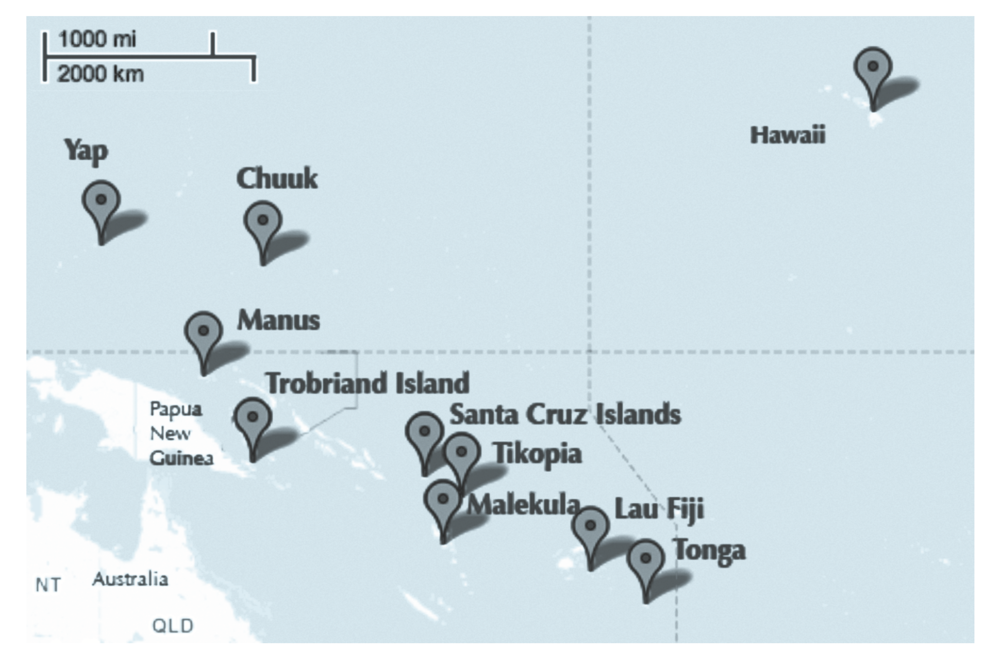

---
title:
css: style.css
output:
  revealjs::revealjs_presentation:
    reveal_options:
      slideNumber: true
      previewLinks: true
    theme: white
    center: false
    transition: fade
    self_contained: false
    lib_dir: libs
---
##
<center>
<h2>Bayesian Generalized Linear Models</h2>
</center>
\
<!-- add some fitted and predictions intervals next time -->

{width="65%"}


```{r prep, echo=FALSE, cache=FALSE, message=FALSE, warning=FALSE}
library(knitr)

opts_chunk$set(fig.height=5, fig.width=7, comment=NA, 
               warning=FALSE, message=FALSE, 
               dev="jpeg", echo=FALSE)

library(rethinking)
library(dplyr)
library(tidyr)
library(ggplot2)
#center plot titles
theme_set(theme_bw())
theme_update(plot.title = element_text(hjust = 0.5))

```


## Our Models Until Now
Likelihood:  
$y_i \sim Normal(\mu_i, \sigma)$  
\
Data Generating Process  
$\mu_i = \alpha + \beta_1 x1_i + \beta_2 x2_i + ...$  
\
Priors:  
$\alpha \sim Normal(0, 100)$  
$\beta_j \sim Normal(0, 100)$    
$\sigma \sim cauchy(0,2)$  

## Making the Normal General
Likelihood:  
$y_i \sim Normal(\mu_i, \sigma)$  
\
Data Generating Process with identity link  
f($\mu_i) = \alpha + \beta_1 x1_i + \beta_2 x2_i + ...$  
\
Priors:  
...  

## A Generalized Linear Model
Likelihood:  
$y_i \sim D(\theta_i, ...)$  
\
Data Generating Process with identity link  
f($\theta_i) = \alpha + \beta_1 x1_i + \beta_2 x2_i + ...$  
\
Priors:  
...  

## The Exponential Family is MaxEnt!


## How to determine which non-normal distribution is right for you
* Use previous image to determine  
\
* Bounded values: binomial, beta  
\
* Counts: Poisson, multinomial, geometric  
\
* Distances and durations: exponential, gamma (survival or event history)  
\
* Monsters: Ranks and ordered categories  
\
* Mixtures: Beta-binomial, gamma-Poisson, zero- inflated processes

## Binomial Logistic Regression
Likelihood:  
$y_i \sim B(size, p_i)$  
\
Data Generating Process with identity link  
logit($p_i) = \alpha + \beta_1 x1_i + \beta_2 x2_i + ...$  
\
Priors:  
...  

## Why Binomial Logistic Regression
- Allows us to predict **absolute** probability of something occuring  
\
- Allows us to determing **relative** change in risk due to predictors

## Why a Logit Link?

<div style="font-size:11pt">McElreath 2016</div>

## Meaning of Logit Coefficients
$$logit(p_i) = log \frac{p_i}{1-p_i} = \alpha + \beta x_i$$

- $\frac{p_i}{1-p_i}$ is *odds* of something happening  
\
- $\beta$ is change in *log odds* per one unit change in $x_i$  
     - exp($\beta$) is change in odds  
     - Change in **relative risk**  
\
- $p_i$ is *absolute probability* of something happening
     - logistic($\alpha + \beta x_i$) = probability
     - To evaluate change in probability, choose two different $x_i$ values

## Binomial GLM in Action: Gender Discrimination in Graduate Admissions


## Our data: Berkeley
```{r ucb, echo=TRUE}
data(UCBadmit)
head(UCBadmit)
```

## 
\
\
\
<h1>What model would you build?</h1>
```{r ucb, echo=FALSE}
```

## One Model
```{r ecb_mod1, echo=TRUE}
#female = 1, male = 2
UCBadmit$gender <- as.numeric(UCBadmit$applicant.gender)

mod_gender <- alist(
  #likelihood
  admit ~ dbinom(applications, p),
  
  #Data generating process
  logit(p) <- a[gender],
  
  #priors
  a[gender] ~ dnorm(0,10)
)

fit_gender <- map(mod_gender, UCBadmit)
```

## What do Priors Imply in a GLMS?
```{r prior_sim, echo = TRUE}
#Let's simulate some priors!
prior_sims <- rnorm(1e4, 0, 10)

#back-transformed!
outcomes <- inv_logit(prior_sims)
```

## Visualize what that means!
```{r show_prior, echo = TRUE}
ggplot(data.frame(outcomes = outcomes),
        aes(x = outcomes)) +
  geom_density()
```

## A Flat Prior in Logit Space Might Not Be Flat!
```{r show_prior, echo = TRUE}
```

## Let's try a few SDs to see what works!
```{r echo = TRUE}
prior_frame <- tibble(sd = seq(0.5, 5, 0.5)) %>%
  rowwise() %>%
  mutate(prior_sims = list(rnorm(1e4,0,sd))) %>%
  unnest(prior_sims) %>%
  mutate(prior_sims = inv_logit(prior_sims))
```

## What is our flat prior?
```{r}

ggplot(prior_frame, 
       aes(x = prior_sims, 
           group = factor(sd),
           color = factor(sd), 
           fill = factor(sd))) +
  geom_density(alpha = 0.5) +
  facet_wrap(~sd)
```

## A New Model
```{r ecb_mod2, echo=TRUE}
mod_gender <- alist(
  #likelihood
  admit ~ dbinom(applications, p),
  
  #Data generating process
  logit(p) <- a[gender],
  
  #priors
  a[gender] ~ dnorm(0,1.5)
)
```

## Fit the Model!
```{r fit_ech, echo = TRUE, cache = TRUE, message=FALSE}
fit_gender <- map(mod_gender, UCBadmit)
```


## Results... men do better!
```{r admit_precis, echo=TRUE}
#female = 1, male = 2
precis(fit_gender, depth=2)
```

<div class="fragment">
What it means
```{r p, echo=TRUE}
#Women
logistic(-0.83)

#Men
logistic(-0.22)
```

## Relative comparison: Male Advantage
```{r male_adf, echo=TRUE}
samp <- extract.samples(fit_gender)

exp(mean(samp$a[,2] - samp$a[,1]))
```

```{r plot_diff}
plot(density(samp$a[,2] - samp$a[,1]), main="Male Advantage Distribution",
     xlab="Male - Female Coefficient")
```

## Residuals and Fits
```{r res, echo = TRUE, results = "hide"}
post_pred <- sim(fit_gender)

post_fits <- apply(post_pred, 2, median)

post_res <- sapply(1:nrow(UCBadmit),
              function(i) UCBadmit$admit[i] - post_pred[,i])

res_frame <- tibble(fitted = post_fits, 
                        res = apply(post_res, 2, median),
                        lwr_res = res - apply(post_res, 2, sd),
                        upr_res = res + apply(post_res, 2, sd))
```

## But - can't use raw residuals
```{r show_res, echo = TRUE}
ggplot(res_frame,
       aes(x = fitted, y = res, 
           ymin = lwr_res, ymax = upr_res)) +
  geom_pointrange()
```

## But - can't use raw residuals
```{r res_qq, echo = TRUE}
library(tidyr)
res_tib <- as_tibble(post_res) %>%
  gather(variable, value) %>%
  group_by(variable) %>%
  summarize(res = median(value))

ggplot(res_tib, aes(sample = res)) + 
  geom_qq() + geom_qq_line()
```

## Quantiles of Residuals via Simulation
- Remember that QQ Norm plots don't work?  
\
- But we can get quantiles of predictions relative to posterior prediction  
\
- What % are < the observed value

```{r post_pred_q_1, echo=TRUE}
#figure out how much of each column < observation
quants <- sapply(1:nrow(UCBadmit), function(i){
  
  #what fraction of predictions < the observation
  sum(post_pred[,i] < UCBadmit$admit[i])/nrow(post_pred)
  
})
```

## QQ Unif Looks..not great....
```{r post_pred_qq_plot, echo=TRUE}
#get the quantiles from the uniform distribution
gap::qqunif(quants, logscale=FALSE)
```

## Why wasn't this a good model?
```{r postcheck, cache=TRUE, results="hide", echo = TRUE}
postcheck( fit_gender , n=1e4 )
```

## Why wasn't this a good model?
```{r postcheck3, cache=TRUE, results="hide", echo = FALSE}
postcheck( fit_gender , n=1e4 )

# draw lines connecting points from same dept
for ( i in 1:6 ) {
    x <- 1 + 2*(i-1)
    y1 <- UCBadmit$admit[x]/UCBadmit$applications[x]
    y2 <- UCBadmit$admit[x+1]/UCBadmit$applications[x+1]
    lines( c(x,x+1) , c(y1,y2) , col=rangi2 , lwd=2 )
    text( x+0.5 , (y1+y2)/2 + 0.05 , UCBadmit$dept[x] , cex=0.8 , col=rangi2 )
}
```

## Departments Not Centered on 0 when we consider Department!

```{r res_dept, echo = TRUE, eval=TRUE}
UCB_full <- cbind(UCBadmit, res_frame)

ggplot(UCB_full, mapping = aes(x = dept, y = res)) +
  geom_boxplot()
```


## So, department...

```{r ecb_mod3, echo=TRUE}
#Make a dept index
UCBadmit$dept_id <- as.numeric(UCBadmit$dept)

mod_gender_dept <- alist(
  #likelihood
  admit ~ dbinom(applications, p),
  
  #Data generating process
  logit(p) <- a[dept_id] + b[gender],
  
  #priors
  a[dept_id] ~ dnorm(0,0.5),
  b[gender] ~ dnorm(0,0.5)
)

fit_gender_dept <- map(mod_gender_dept, UCBadmit)
```

## Did it work?
```{r postcheck2, echo=TRUE, cache=TRUE, results="hide"}
postcheck(fit_gender_dept)
```

## QQ Unif...
```{r post_pred_q, echo=TRUE, eval = FALSE}
#sim gets predictions
post_pred_2 <- sim(fit_gender_dept, refresh=0)

#figure out how much of each column < observation
quants_2 <- sapply(1:nrow(UCBadmit), function(i){
  #what fraction of predictions < the observation
  sum(post_pred_2[,i] < UCBadmit$admit[i])/nrow(post_pred_2)
})

gap::qqunif(quants_2, logscale=FALSE)
```

## Quantile Residuals say Yes!
```{r post_pred_q, echo=FALSE, eval = TRUE}
```

## Outcomes
```{r gender}
precis(fit_gender_dept, depth=2)
```

\
\
<div class="fragment">What do coefficients mean?</div>  
<div class="fragment">Note that difference has reversed!</div>
\
<div class="fragment"><center>**Simpson's Paradox!**</center></div>

## Tool Use and Poisson Regression


## What drives tool use?
```{r kline}
data(Kline)
head(Kline)
```

## How to Handle the data?
```{r kline_data0}
ggplot(Kline,
       aes(x = population, y = total_tools)) +
  geom_point()
```

## OK, Population scale is off - log it?
```{r kline_data_log}
ggplot(Kline,
       aes(x = log10(population), y = total_tools)) +
  geom_point()
```

## Center Population, as our smallest still have 1K People!
```{r kline_data_log_cent}
ggplot(Kline,
       aes(x = log(population) - mean(log(population)), y = total_tools)) +
  geom_point()
```


## A Simple Model
```{r kline_simp, eval = FALSE, echo = TRUE}

Kline$P <- log(Kline$population) - mean(log(Kline$population))
  
kline_mod <- alist(
  #likelihood
  total_tools ~ dpois(lambda)
  
  #DGP
  log(lambda) <- a + b * P
  
  #priors
  ...
)
```

## What should our priors be? Data
```{r kline_data_log_cent}
```

## Try out a few
```{r int, echo = TRUE}
a_priors <- crossing(m = 0:3, 
                     s = seq(0.5,3,.5)) %>%
  rowwise() %>%
  mutate(value = list(rnorm(1e4, m, s))) %>%
  unnest()
```

## Visualize Priors (data centered on ~40)
```{r}
ggplot(a_priors,
       aes(x = exp(value))) +
  geom_density() +
  facet_grid(m ~ s, scale = "free")
```

## What about b?
```{r slope, echo = TRUE}
b_priors <- crossing(m = 0:3, 
                     s = seq(0.1,1,.1)) %>%
  rowwise() %>%
  mutate(value = list(rnorm(1e2, m, s))) %>%
  unnest() %>%
  
  #make the line
  crossing(p = seq(-3,3, length.out=100)) %>%
  mutate(tools_sim = exp(value*p))
```

## What about b?
```{r}
ggplot(b_priors,
       aes(x = p, y = tools_sim, group = value)) +
  geom_line() +
  facet_grid(m ~ s, scale = "free")
```

## What about b?
```{r}
ggplot(b_priors %>% filter(s < 0.5),
       aes(x = p, y = tools_sim, group = value)) +
  geom_line() +
  facet_grid(m ~ s, scale = "free")
```


## A Simple Model
```{r kline_simp2, eval = TRUE, echo = TRUE, cache=TRUE}
Kline$P <- log(Kline$population) - mean(log(Kline$population))

kline_mod <- alist(
  #likelihood
  total_tools ~ dpois(lambda),
  
  #DGP
  log(lambda) <- a + b * P,
  
  #priors
  a ~ dnorm(3,0.5),
  b ~ dnorm(1,0.2)
)

kline_fit <- map2stan(kline_mod, data = Kline)
```

##Did we converge?
```{r converge_pois, echo = TRUE}
plot(kline_fit)
```

## Check your posterior
```{r postcheck_pois, message=FALSE, results="hide", echo = TRUE}
postcheck(kline_fit)
```

## Check Quantile Residuals
```{r post_pred_pois, echo=TRUE, eval = FALSE}
#sim gets predictions
kline_post_pred <- sim(kline_fit, refresh=0)

#figure out how much of each column < observation
quants_kline <- sapply(1:nrow(Kline), function(i){
  #what fraction of predictions < the observation
  sum(kline_post_pred[,i] < Kline$total_tools[i])/nrow(kline_post_pred)
})

gap::qqunif(quants_kline, logscale=FALSE)
```

## Check Quantile Residuals
```{r post_pred_pois, echo=FALSE, eval = TRUE}
```

## Outcomes?
```{r out, echo = TRUE}
precis(kline_fit)
```

## Should the link really be linear?
```{r kline_linear, eval = TRUE, echo = TRUE, cache=TRUE}
Kline$P <- log(Kline$population) - mean(log(Kline$population))

kline_linear <- alist(
  #likelihood
  total_tools ~ dpois(lambda),
  
  #DGP
  lambda <- a + b * P,
  
  #priors
  a ~ dnorm(3,0.5),
  b ~ dnorm(1,0.2)
)

kline_linear_fit <- map2stan(kline_linear, data = Kline)
```

## Should the link really be linear?
```{r compare, echo = TRUE}
compare(kline_fit, kline_linear_fit)
```

## Your turn -  What drives tool use?
```{r kline}
```
