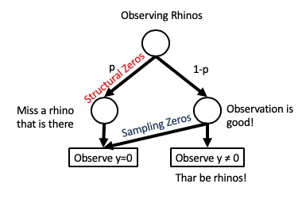

```{r setup, include=FALSE, warning=FALSE}
library(tidyverse)
library(rethinking)
library(ggplot2)
library(glmmTMB)
library(pscl)
library(mgcv)
library(tidybayes)
library(tidybayes.rethinking)
theme_set(theme_bw(base_size=12))
knitr::opts_chunk$set(echo = TRUE)
```

## 1. What is Zero Inflation?

In a wide variety of applications, we find data that has an excess of zeros. For example, consider the example from McElreath where monks working in a monastary to copy pages either 1) get drunk and don't do anything, so they produce 0s or 2) work, and either produces 0, 1, 2, 3, or more manuscripts In such a dataset, you would expect an excess of zeros due to a *structural* property of the data generating process - namely that some zeroes are due to a probability of no pages being written, in this case. Let's see how he simulates this.

```{r}
library(rethinking)

# define parameters
prob_drink <- 0.2 # 20% of days
rate_work <- 1    # average 1 manuscript per day
# sample one year of production
N <- 365

# simulate days monks drink
set.seed(365)
drink <- rbinom( N , 1 , prob_drink )

# simulate manuscripts completed
y <- (1-drink)*rpois( N , rate_work )
```


Notice in the last piece that we FIRST get a random binomial of work or no work, THEN use a poisson to get the number of pages generated. Let's plot this and see the different sources of zeroes.

```{r}
monks <- data.frame(drink = drink, manuscripts = y)

ggplot(monks, aes(x = manuscripts, fill = factor(drink))) +
  geom_bar()
```

So, there are more zeroes than we'd expect from a poisson with a lambda of 1, AND we see that this is again a mixture distribution - a compounding of a binomial and a poisson.

There are many types of zero inflated - or zero augmented - distributions out there. Think of any distribution, but then assume some process is adding more zeroes! We'll talk about a few, but you can dream up just about anything you'd like. Commonly you'll hear about ZIPs, ZIBs, ZINBs, or even ZINs. We also run into Zero Augmented - or Hurdle - models like ZAGs, ZALNs (zero augmented log-normal distributions), and more.


### 1.1 Why are we accounting for zero inflation?

Quite simply, not accounting for an excess of zeros will inevitably downward bias your parameter estimates. I leave this to the reader to contemplate why. 

### 1.2 Zero Inflation versus Hurdle Models

Zero Inflation and Zero Augmentation, or Hurdle, distributions mean two different things. The difference comes from two types of zeroes.  
\
**Structural Zeros** come from some probabilistic process that prevents an outcome. The monks got drunk, so they produced no manuscripts! Or, you didn't see that hippo because it was underwater when you were doing your surveys! Or, the cost of fish was too low, so fishermen just didn't go to see to catch anything, and so had zero catch! There are a lot of possible causes of structural zeroes - and they can be modeled.  
\
**Sampling Zeros** come from the data generating process that is generating your observations. So, a monk just didn't finish any manuscripts that day. Or habitat was of poor quality, so you didn't count any hippos. Or waves were too high, and fishermen didn't catch anything.  
\

Consider the example in the figure below of going to observe rhinos in the wild. If you count 0 because, perhaps they are there but you fail to detect them, that is a *structural zero*. You have the probability, p, of a structural zero. If your observation would have detected rhinos if they were there, but there just happen to be none, that's a **sampling zero**.



Zero Inflated models comprise of a mix of structural and sampling issues. Hurdle models are ones where you *only have structural zeros*. We often find these cropping up with distributions which cannot have zeros in them, for example.

Let's look at how we fit a few different zero augmented models to get a feel for them


## 2. The Zero Inflated Poisson

As we have the monk data at hand already, we can use it as a handy starting point for ZIP models.

### 2.1 ZIP with Likelihood

We can fit a ZIP model using a variety of packages in R. For example,

```{r zip1}
library(pscl)

monk_pscl <- zeroinfl(manuscripts ~ 1, data = monks)

summary(monk_pscl)
```

Here you can explicitly see that we're estimating a binomial model with a logit link for the zero inflatino part. And as it's a logit coefficient, we can see that the probability of no work is `r inv_logit(-1.2079)` By putting a `|` after the intercept, we could model the zero inflation process itself with another equation.

See also how the answer differs from `glm`

```{r}
coef(glm(manuscripts ~ 1, data = monks, family = poisson))
```

Other packages also implement zero inflation. I inclde `pscl` as it wsa the most common one for some time. More recently, `glmmTMB` has implemented a pretty robust and flexible zero inflation and hurdle schema which I rather like.

```{r}
library(glmmTMB)

monk_tmb <- glmmTMB(manuscripts ~ 1,
                    ziformula = ~ 1,
                    family = poisson,
                    data = monks)

summary(monk_tmb)

fixef(monk_tmb)[2]$zi |> inv_logit()
```

The results are the same, but, you can include whatever family you'd like - just include some zero inflation! 

### 2.2 ZIP and Bayes

Rethinking provides some comfort here. It provides a `dzipois` density which takes a probability of a zero and a lambda.The trickier part is that we now have two relationships - one for the logit link of the drink/no drink and a second log link for manuscripts.


```{r}
zip_mod <- alist(
  
  #likelihood
  manuscripts ~ dzipois(p, lambda),
  
  #data generating process
  logit(p) ~ a,
  log(lambda) ~ b,
  
  #priors
  a ~ dnorm(-1,2),
  b ~ dnorm(0,5)
)

zip_fit <- quap(zip_mod, data = monks)
```

This model produces very similar output with differences only due to priors

```{r}
precis(zip_fit)
```

Feel free to look at postcheck or other diagnostics here to see if we're ok. And, note, when the two parts of this relationship become trickier, you will need to resort to `ulam()`.

## 3. ZIB

Yes. It's true. A binomial process can be due to structural and sampling zeros. It's two coupled binomial models.


Let's look at the fishing in state parks dataset from rethinking. We'll apply two quick transformations with the idea of, we want to see if you're more likely to catch a fish if you're hanging out with more people or if having kid's with you just throws the whole day to hell.


```{r}
data(Fish)

Fish <- Fish %>%
  mutate(caught_anything = as.numeric(fish_caught>0),
         with_kids = as.factor(child>0))

FishPlot <- ggplot(Fish,
       aes(x = persons, y = caught_anything, color = with_kids)) +
  geom_jitter(position = position_jitter(width = 0.3, height = 0.1))

FishPlot
```

We can see a lot of zeros when people come with kids! 

## 3.1 ZIBs and Likelihood

```{r glmmTMB}
zib_tmb <- glmmTMB(caught_anything ~ persons,
                   ziformula = ~ with_kids+0,
                   family = binomial,
                   data = Fish)
```

What's the chance you won't catch fish if you bring kids?

```{r}
inv_logit(fixef(zib_tmb)$zi[2])
```

Whoah. That's big.

## 3.1 ZIBs and Bayes

We can take the model above and easily recode it into rethinking using flat priors using the `dzibinom` density, which will take two different logistics.

```{r}
mod_zib <- alist(
  #Likelihood
  caught_anything ~ dzibinom(p_zero, size, prob_caught),
  
  #DGP
  logit(prob_caught) <- a + b*persons,
 logit(p_zero) <- b_kids[with_kids],
  
  #priors
  a ~ dnorm(0,10),

  b ~ dnorm(0,10),
  b_kids[with_kids] ~ dnorm(0,5)
)

fit_zib <- quap(mod_zib, 
               data = Fish |> 
                 mutate(size = 1, 
                        with_kids = as.numeric(with_kids)))
```

Which produces broadly similar results.
```{r}
precis(fit_zib, depth = 2)
```

The only real difference is the probability of getting a 0 without kids. But if you `inv_logit` it, you can see it's very small - as is the results from the `glmmTMB` fit above. And the zero inflation of having kids - `r inv_logit(coef(fit_zib)[4])` - is about the same. Ah, Kids.

## 3.1.1 ZIBs and Bayes

Given that the probability of catching a fish is the compounded probability of having kids and number of people, we can look at the resulting probabilities via simulation. I'm bumping the size up to 100 so we can get a more smooth estimate of probability at each data point from `sim`.

```{r zib_bayes}
#input data frame
pred_df <- crossing(persons = seq(1,4,length.out=100), 
                    with_kids = c(1,2), 
                    size = 100)

#get predictions with error
pred_zib <- predicted_draws(fit_zib, pred_df)|>
  mutate(caught_anything = .prediction/100,
         with_kids = c(FALSE, TRUE)[with_kids])

#visualize
FishPlot +
   facet_wrap(~with_kids) +
  stat_lineribbon(data = pred_zib, 
                  color = "black", 
                  alpha = 0.2) +
  scale_fill_brewer(palette = "Blues")
 


```

## 4. ZINB
Knowing that kids make things difficult (am I working out some issues here? Maybe I am!), we can notice that the dataset actually looks at the NUMBER of fish caught. Now, normally we'd look at this as a poisson (or a ZIP!) but, let's look at the distribution of catch by number of people.

```{r}
library(ggridges)
ggplot(data = Fish, 
       mapping = aes(x = fish_caught, y = as.factor(persons), fill = as.factor(with_kids))) +
  geom_density_ridges(alpha = 0.7)

```

Looking at this, we can see that the data is not only clearly 0 inflated, but, wow, that's a long tail. A poisson is going to be a bad choice. Instead, a negative binomial is going to be the way to go.

The ZINB model is a fairly common one for this type of situation.  Rather than belabor the point, here's a `glmmTMB` example with a ZINB. Note that I'm using nbinom1 here. This is a great way to model overdispersion, as instead of the variance expanding with the square of the mean, it expands linearly with the mean. Again, a modeling choice!

```{r zinb}
zinb_tmb <- glmmTMB(fish_caught ~ persons,
                   ziformula = ~ with_kids+0,
                   family = nbinom1,
                   data = Fish)
```

And you can then work from there. What do you see here?

```{r zinb_sum}
summary(zinb_tmb)
```

<!--
Similarly, we can do this in a Bayesian framework.

```{r, eval = FALSE}
mod_zinb <- alist(
  #Likelihood
  fish_caught ~ dzibinom(p_zero, size, prob),
  
  #transformation for nbinom
  #prob = size/(size+mu),
  prob <- size/(size+est_fish_caught),
  
  #DGP
 log(est_fish_caught) <- a + b*persons,
 logit(p_zero) <- b_kids[with_kids],
  
  #priors
  a ~ dnorm(3,2),
  size ~ dexp(2),

  b ~ dnorm(0,5),
  b_kids[with_kids] ~ dnorm(0,5)
)

fit_zinb <- quap(mod_zinb, 
                data = Fish %>% mutate(size = 1, 
                                       with_kids = as.numeric(with_kids)))

```

-->
## 5. Gone Fishing - Gama Hurdles

We can also use continuous data. This is most common with Gamma distributed data, as you cannot have a waiting time of 0. Let's use a simulated data set looking at duration of offshore fishing trips in days given average wave height.

```{r load_data}
fishing <- read.csv("https://biol609.github.io/lectures/data/20/fishing_duration.csv")

#what's there
head(fishing)

#visualize the data
plot(days_at_sea ~ seas_m, data=fishing)
```

### 5.1. Exploratory Analysis Decisions

OK, let's assume you have no a priori knowledge about this data save the variables in it. You are interested in just a bivariate relationship. Period.  
\
Now, in building a model for this, you have to decide on three things.  
\
1. What is the data generating process?  
2. What is the error generating process - the distribution of the variation around predicted values?  
3. As we're using Bayes, do we have information that can allow us to provide weakly informative priors?  

### 5.2 The data generating process

On the data generating process, we can look at the data and see, hey, we have a negative relationship, and its one that cannot be less than 0. This suggests a power or exponential relationship. An exponential (log link function) seems pretty reasonable.

### 5.3 The error generating process

This one is harder. We have made some decisions that are useful. We have no non-negative values. We have continuous data. So, no normal distribution. And no Poisson or other count distribution. But what are we left with. Log-normal? Gamma? Erlang? Weibull? Others (oh, and there are others).  

We have a few options - we can plot histograms, plot densities at each predictor value (or bin of predictor), we can fit a gaussian model, know that it's wrong but look at its residual distribution, we can stare at our scatterplot and ponder.  

What we're pondering is *histomancy* - the mystic ability to divine distributions from a histogram or density plot.  

It is a terrible idea.  

Instead, let's actually use science and some thought. In this case, we're looking at a distribution of durations (days at sea). There's some underlying thing that determines the duration that someone stays at sea. This fits naturally to a Gamma distribution. Others could work here, too, but, a Gamma is also maximum entropy distribution for data from 0 to infinity where the variance increases with the mean. And a member of the exponential family, so fairly easy to work with. So, yes, you could choose others, but for biological plausibility, and ease of use, it's an excellent first choice.

#### 5.3.1 The Gamma


As a quick reminder of what the gamma is, it's a distribution that can be defined with either a shape parameter and a rate of events happening (1/time to event - in this case, the decision to port) or the same shape parameter and a scale parameter which is 1/rate (so, time for 1 event to happen). This can lead to a little bit of confusion, as you'll see it presented either way. Personally, I like rate, but either will work

So, below, as we increase the rate, we have more and more short wait times for 1 event.

```{r gamma, message=FALSE}
library(tidyr)
library(dplyr)
library(ggplot2)

gamma_frame <- crossing(rate = seq(0.1, 2, length.out=5), 
                        shape=1, 
                        x=seq(0.01, 5, length.out=200)) %>%
  mutate(d = dgamma(x, shape = shape, rate = rate))

ggplot(gamma_frame, aes(x=x, y=d, color=factor(rate))) +
  geom_line()

```

To make things a bit easier, the mean of a gamma is mu = shape * scale. This leads to a few relationships/transformations which can become useful.  

shape = mu/scale  
rate = shape/mu  
scale = mu/shape  

It's a bit of a pain, as depending on how you put things together, you can get slightly different results from models. But it should not matter to qualitative outcomes.

### 5.4 Priors

In this case, we don't really have any prior information! So we want flat priors. We can use regularization - say, b ~ dnorm(0,3), but how much depends on you. We're also going to want priors for scale or rate parameters. These can be normal, but often cauchy (for scale) or exponential (for rate) priors work well. YMMV.

### 5.5. Fitting with a Gamma


#### 5.5.1 The model
So, let's start with `dgamma`. By default, `dgamma` takes first a shape and then a rate argument. This presents a small challenge, as above we have shape = rate/mu. This means we would need to work with our mean value a bit. Rather than a straight `log(mu)` statement, we're going to need to use the calculated value.  Let's put together a model.


```{r gamma_mod, message=FALSE, warning=FALSE}
library(rethinking)

fishing_gamma_mod <- alist(
  #likelihood
  #noting that rate = shape/exp(log_mu)
  days_at_sea ~ dgamma(shape, shape/exp(log_mu)),
  
  #data generating process
  log_mu <- a + b*seas_m,
  
  #priors
  a ~ dnorm(0,100),
  b ~ dnorm(0,100),
  shape ~ dexp(2)
)
```


McElreath has also put together a shortcut, `dgamma2`, but it tends to produce slightly different results, as it calculates shape as a function of the predictors. So I'm not a yuge fan.

```{r gamma_mod_2}
fishing_gamma_mod2 <- alist(
  #likelihood
  days_at_sea ~ dgamma2(mu, scale),
  
  #data generating process
  log(mu) <- a + b*seas_m,

  #priors
  a ~ dnorm(0,100),
  b ~ dnorm(0,100),
  scale ~ dcauchy(0,2)
)
```

#### 5.5.2 The fit

OK, let's fit this thing using the first model!  

```{r fit_gamma, error=TRUE}
fishing_gamma_fit <- map(fishing_gamma_mod, data=fishing)
```

Uh oh! What's wrong?  

and now, we encounter mistake #1. Remember that we're using a log link? Well, log(0) is not a number, so, of course our model fails! So we need to drop those 0s. They mean that a fisherman didn't leave port at all, and are likely best conisdered as a separate process. Regardless, even if we want to fold them back in (see below), we would be greatly helped by building a model that does not require handling those details.

```{r fit_gamma_good, error=TRUE}
fishing_clean <- fishing %>% filter(days_at_sea != 0)

set.seed(609)
fishing_gamma_fit <- map(fishing_gamma_mod, data=fishing_clean)
```

Oops! That didn't work either! Well that's not good. So, what does the error say? That start values were invalid.  OK.

Welp, eyeballing the graph of the data, we see a positive intercept and negative slope. So, even with the same seed (other seed values allow for convergence), let's re-try!

```{r fit_gamma_really_good}
set.seed(609)
fishing_gamma_fit <- map(fishing_gamma_mod, data=fishing_clean,
                         start = list(a=1, b=-1))
```

Fit!

#### 5.5.3 Model evaluation

Let's check out our posterior!

```{r post_normal}
pairs(fishing_gamma_fit)
```

Hey! Not bad. Indeed, I wouldn't even go to STAN with a fit like this.

```{r postcheck, error=TRUE, results="hide", message=FALSE}
par(mfrow=c(2,3))
postcheck(fishing_gamma_fit)
par(mfrow=c(1,1), ask=F)
```

Looking pretty good! there are one or two points outside of the predictive CI, but, eh, that's not bad considering the large number of data points we have. Worth investigating, but not losing too much sleep over.

#### 5.5.4 What do the results say?

We can first look at the general results

```{r precis_gamma}
precis(fishing_gamma_fit)
```

So, a decline of -0.63, or, for every 1m wave, fishermen would spend 53% less time at sea (`exp(-0.63)`). We can't say absolute days here, as this is a nonlinear function - what happens in absolute units going from 2 to 3 is different from 3 to 4. But we can judge it on a percentage scale. Try calculating it out if you don't believe it.  

We can also visualize the results

```{r fit_plot, results="hide"}
#start with a fresh data frame of predicted values
pred_df <- data.frame(seas_m = seq(0,5,length.out=200))

#OK, now get some sim and link output
sim_fishing <- sim(fishing_gamma_fit, data=pred_df)

#note, for link, we need to exponentiate
link_fishing <- exp(link(fishing_gamma_fit, data=pred_df))

#smoosh it all together
pred_df <- pred_df %>%
  mutate(days_at_sea = apply(link_fishing, 2, median),
         lwr_fit = apply(link_fishing, 2, HPDI)[1,],
         upr_fit = apply(link_fishing, 2, HPDI)[2,],
         lwr = apply(sim_fishing, 2, HPDI)[1,],
         upr = apply(sim_fishing, 2, HPDI)[2,]
         )

#a nice ggplot
ggplot(data=pred_df,
       mapping=aes(x=seas_m, y=days_at_sea)) +
  geom_ribbon(mapping=aes(ymin=lwr, ymax=upr), alpha=0.4) +
  geom_ribbon(mapping=aes(ymin=lwr_fit, ymax=upr_fit), fill="blue", alpha=0.4) +
  geom_line(lwd=1, color="red") +
  geom_point(data=fishing_clean) +
  theme_bw(base_size=17)
```

Not bad. We can see the results of a Gamma distribution - the mean variance scaling relationship. We can see we have some outliers to inspect, but, overall, pretty darned good.

## 6. About those Zeroes - Zero Augmented Gamma


### 6.1 Zero Inflation, augmentation, hurdles, and more

Excessive zeroes are not something to be scared of. Of which to be scared? Whatever, you guys know this on a deep level. Because a zero inflated or zero augmented distribution is nothing more than the lovechild of a binomial logistic regression and a GLM of your own choosing.

Let's start by thinking about a Hurdle or Zero Augmented model. In these models, you cannot have any zeroes for reasons related to constrains of your data generating process or error generating process. Instead, Zeroes are generated by one data generating process, then another process determines the relationship with your response variable. So, you first split your model into one where you have either 0 or non-0 outcomes, and perform a logistic regression. With whatever predictors you want. Then, with all of the non-zero outcomes, you perform whatever GLM you want.

A Zero Inflated or Zero Augmented model is slightly different. Here, zeroes are generated either by some process that is binary - a thing happened or it didn't - OR they are generated by whatever  data generating process you are modeling.


Zero Inflated models come in many forms - Zero Inflated Poisson (uses `dzipois(lambda, p)` in rethinking), Zero Inflated Binomial (uses `dzibinom(p_zero, size, p)`), Zero Augmented Gamma (`dzagamma2(prob, mu, scale)`) and more which can be pulled from other libraries in R.

### 6.2 How do I know if it is zero inflated 

There are two straightforward ways to see if something is zero inflated. First, what's the distribution look like? Do you see a lot of zeros?

```{r zdens}
plot(density(fishing$days_at_sea))
```

OK - lots of zeroes - which, given that this is a Gamma, is super suspect. But, for this or other distributions, they might be OK. Sometimes you'll even see two humps - one around zero, one somewhere else. Zero Inflation!

You can also look at a scatterplot and see if there are a suspicious number of zeroes across all of the values of a predictor variable. Sure, you might ahve a non-normal distribution, but that kind of pattern is a bit odd.

```{r full_scatter}
plot(days_at_sea ~ seas_m, data=fishing)
```

### 6.3 Using the ZAG

To work with our original data - zeroes and all - we can use a Zero Augmented Gamma Distribution. I'm still not a huge fan of `dzagamma2` so let's make our own using the rate formulation. To do this, I literally just entered `dzamma2` in R, then rewrote the function a bit to use the rate formulation.

```{r dzagam}

dzagamma <- function (x, prob, shape, rate, log = FALSE) 
{
  K <- as.data.frame(cbind(x = x, prob = prob, shape = shape, rate = rate))
  llg <- dgamma(x, shape = shape, rate = rate, log = TRUE)
  ll <- ifelse(K$x == 0, log(K$prob), log(1 - K$prob) + llg)
  if (log == FALSE) 
    ll <- exp(ll)
  ll
}
```

Let this be a less - you can put in whatever density function you want - if R doesn't have it, write your own! Heck, this format is a really straightforward way to turn any distribution - normal, whatever - into a zero inflated distribution.

In this distribution, we'll have a lot of extra 0s. What's great is that we can appropriate our earlier model for use here.

```{r zag_mod}
fishing_zagamma_mod <- alist(
  #likelihood
  #noting that rate = shape/exp(log_mu)
  days_at_sea ~ dzagamma2(prob, mu, scale),
  
  #data generating process
  log(mu) <- a + b*seas_m,
  
  #priors
  a ~ dnorm(0,100),
  b ~ dnorm(0,100),
  scale ~ dexp(2),
  prob ~ dunif(0,1)
)
```

We have no info on the probability, so, we're just putting in a flat uniform prior between 0 and 1. We could use a beta if we wanted, but, meh. We can then fit this, using our lessons about start values from before.

```{r zag_fit}
fishing_zagamma_fit <- quap(fishing_zagamma_mod, data=fishing,
                         start = list(a=1, b=-1))
```

### 6.4 Evaluation

Let's look at those posteriors!

```{r pairs_zag}
pairs(fishing_zagamma_fit)
```

The pairs plot looks nice and well behaved. Other checks and `sim` are a bit more difficult, as they require a random number generator which we currently... don't have. So, let's make one.

```{r rzag}
rzagamma2 <- function(n, prob, scale, rate){
  is_zero <- rbinom(n, 1, prob=1-prob)
  is_zero * rgamma(n, scale = scale, rate)
}
```

With this, we can use postcheck

```{r postcheck_zag}
par(mfrow=c(3,3))
postcheck(fishing_zagamma_fit)
par(mfrow=c(1,1), ask=F)
```

Hey - it's all of the data! And it looks - good! 


#### 6.5 What do the results say?

We can first look at the general results

```{r precis_zgamma}
precis(fishing_zagamma_fit)
```

No surprise, our coefficients are exactly the same as before! Wahoo! Except now we also know there's a 30% chance on any given day that a fisherman will just say 'meh' and not go do sea.

We can also visualize the results. First, we will plot the prediction for JUST the non-zero results using the fitted model. Then we will contrast it to putting in the full 0's prediction, which comes from the ZAG distribtion.

```{r}
# a prediction frame
pred_zag <- predicted_draws(fishing_zagamma_fit,
                            data.frame(
                              seas_m = seq(0, 5,
                                           length.out = 100)),
                            value = "days_at_sea")


# a linpred frame
fit_zag <- linpred_draws(fishing_zagamma_fit,
                            data.frame(
                              seas_m = seq(0, 5,
                                           length.out = 100)),
                            value = "days_at_sea")

# fit interval of link - not with ZAG
ggplot(fit_zag,
       aes(x = seas_m, y = days_at_sea)) +
  stat_lineribbon() +
  scale_fill_brewer(palette = "Greens") +
  geom_point(data = fishing)

# prediction interval
ggplot(pred_zag,
       aes(x = seas_m, y = days_at_sea)) +
  stat_lineribbon() +
  scale_fill_brewer(palette = "Oranges") +
  geom_point(data = fishing)
```

Note the difference in CI width and downweighting of the line with just fit. There is a lot more going on here, and the full prediction interval gives us what we need to see.

<!--

```{r fit, results="hide"}
#start with a fresh data frame of predicted values
pred_df_z <- data.frame(seas_m = seq(0,5,length.out=200))

#OK, now get some sim and link output
sim_fishing_z <- sim(fishing_zagamma_fit, data=pred_df_z)

#note, for link, we need to exponentiate
link_fishing_z <- exp(link(fishing_zagamma_fit, data=pred_df_z))

#smoosh it all together
pred_df_z <- pred_df_z %>%
  mutate(days_at_sea = apply(link_fishing_z, 2, median),
         lwr_fit = apply(link_fishing_z, 2, HPDI)[1,],
         upr_fit = apply(link_fishing_z, 2, HPDI)[2,],
         lwr = apply(sim_fishing_z, 2, HPDI)[1,],
         upr = apply(sim_fishing_z, 2, HPDI)[2,]
         )

#a nice ggplot
ggplot(data=pred_df_z,
       mapping=aes(x=seas_m, y=days_at_sea)) +
  geom_ribbon(mapping=aes(ymin=lwr, ymax=upr), alpha=0.4) +
  geom_ribbon(mapping=aes(ymin=lwr_fit, ymax=upr_fit), fill="blue", alpha=0.4) +
  geom_line(lwd=1, color="red") +
  geom_point(data=fishing) +
  theme_bw(base_size=17)
```

It's hard to see the difference relative to the previous plot, but, if you take a gander, the scale of the predictive interval has shrunk a bit. Or, gets pulled towards zero, as it were, as we have a lot of zeroes. Makes sense!
-->