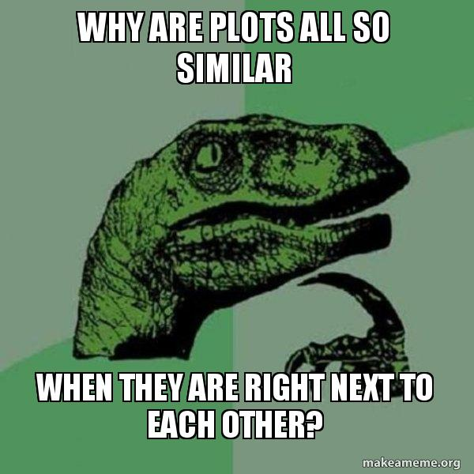

---
title:
css: style.css
output:
  revealjs::revealjs_presentation:
    reveal_options:
      slideNumber: true
      previewLinks: true
    theme: white
    center: false
    transition: fade
    self_contained: false
    lib_dir: libs
---

## 

<h3>Spatial Autocorrelation with GLS</h3>


```{r prep, echo=FALSE, cache=FALSE, message=FALSE, warning=FALSE}
#https://mgimond.github.io/Spatial/index.html
library(knitr)
opts_chunk$set(fig.height=5, fig.width=7, comment=NA, 
               warning=FALSE, message=FALSE, 
               dev="jpeg", echo=FALSE)

library(ggplot2)
library(car)
library(ncf)

library(dplyr)
library(tidyr)
library(broom)

library(sf)
library(sp)
library(spdep)
library(SpatialEpi)
library(brms)
library(glmmTMB)
```

## Much of our data is spatial
```{r read_boreal}
boreal <- read.table("./data/spatial/Boreality.txt", header=T)
```
```{r plot_boreal_raw}

raw_boreal <- qplot(x, y, data=boreal, size=Wet, color=NDVI) +
  theme_bw() + 
  scale_size_continuous("Index of Wetness", range=c(0,7)) + 
  scale_color_gradient("NDVI", low="lightgreen", high="darkgreen")

raw_boreal
```

## Much of our data is spatial
```{r read_penn, message=FALSE}
data(pennLC)
penn <- st_as_sf(pennLC$spatial.polygon) %>%
  mutate(county = unique(pennLC$data$county)) %>%
  left_join(pennLC$data %>% group_by(county) %>% summarize(population = sum(population),
                                                           cases = sum(cases))) %>%
  mutate(rate = cases/population*10000) %>%
  left_join(pennLC$smoking) %>%
  st_transform(3724)

saveRDS(penn, "./data/spatial/penn.Rds")
```

```{r plot_smoking, cache=TRUE}
library(patchwork)
penn_canc_poly <- ggplot(penn) +
  geom_sf(aes(fill = rate)) +
  scale_fill_viridis_c(option = "D", guide = guide_colorbar("Cancer Rate")) +
  theme_minimal() + theme(legend.position="bottom")


penn_smok_poly <- ggplot(penn) +
  geom_sf(aes(fill = smoking)) +
  scale_fill_viridis_c(option = "C", guide = guide_colorbar("Porportion Smoking")) +
  theme_minimal() + theme(legend.position="bottom")

penn_canc_poly + penn_smok_poly
```

## A note up front
> - Spatial data analysis is... a big topic.  
  \
> - Start by learning how to make maps (`sf` library)  
  \
> - Be prepared to dive in. Deep. 

## To Space and Beyond
1. How do we assess spatial autocorrelation?  
  
2. What are the possible patterns of spatial autocorrelation?  
  
3. How do we assess point spatial data?  
  
4. How do we assess polygon spatial data?

## How correlated is NDVI across space?
```{r plot_boreal_raw}
```

## Spatial Autocorrelation and Moran's I
$$I = \frac{N}{W}\frac{\sum\sum w_{ij}(x_i - \bar{x})(x_j - \bar(x))}{\sum(x_i - \bar{x})^2}$$

- W is a weight matrix (1/pairwise distance) with diagonals of 0  
- I = 1, perfect positive correlation, I = -1, perfect anti-correlation  
- $E_i = \frac{-1}{N-1}$ and can be tested

## Calculating Moran's I
1. Make a distance matrix  
  
2. Convert it to a weight matrix  
  
3. Run `spdep::moran.test`

## Making a Weight Matrix
Yes, this is a PITA...

```{r weight, echo = TRUE}
#first, mke a distance matrix of points
boreal_dists <- boreal %>%
  dplyr::select(x,y) %>% 
  dist() %>%
  as.matrix()

#inverse of distance is weight
boreal_dists_weights <- 1/boreal_dists
diag(boreal_dists_weights) <- 0

#turn into a weights list
boreal_w <- mat2listw(boreal_dists_weights)
```

- NB, use projections with true distances (e.g., UTM, not latlong)

## Moran's I
```{r echo = TRUE, cache = TRUE, echo = TRUE}
library(spdep)
moran.test(boreal$NDVI, boreal_w)
```

## What does this look like?
```{r spstat, message=FALSE, warning=FALSE, echo = TRUE, cache=TRUE}
library(ncf)
boreal_cor <- spline.correlog(x=boreal$x, y=boreal$y,
                         z=boreal$NDVI, resamp=100, quiet=TRUE)

plot(boreal_cor)
```


## To Space and Beyond
1. How do we assess spatial autocorrelation?  
  
2. <font color = "red">What are the possible patterns of spatial autocorrelation?</font>  
  
3. How do we assess point spatial data?  
  
4. How do we assess polygon spatial data?

## SAR versus CAR
**SAR:**  
Simultaneous Autoregressive Process
$y_i = BX_i + \sum Sy_ij + \epsilon_{i}$  
\
**CAR:**  
Conditional Autoregressive Process
$y_i | y_{-i} ~\sim \mathcalc{N}{ BX_i + \sum S_{ij}yj, m_{ij}$  

## SAR versus CAR
from https://stats.stackexchange.com/a/9983  
\

**Non-spatial model**  
My House Value is a function of my home Gardening Investment.  
\

**SAR model**  
My House Value is a function of the House Values of my neighbours.  
\

**CAR model**  
My House Value is a function of the Gardening Investment of my neighbours.


## Variograms

- (Semi)variograms allow us to look at variance of squared difference between points at different distances  
\
- Computationally intensive  
\
- Shape tells us what the correlation structure should be  
\
- With a fit covariance function, can estimate the whole surface


## Our Variogram
```{r vario, echo = TRUE}
library(gstat)

v_boreal <- variogram(NDVI ~ 1, loc= ~x+y, data = boreal)
plot(v_boreal)
```

## Anatomy of a Variogram


## Spatial Correlation Matrix
$$ cor(\epsilon) = \begin{pmatrix}
1 & \rho_{ij} &\rho_{ik} & ... \\ 
\rho_{ji} &  1& \rho_jk & ...\\ 
\rho_{ki} & \rho_{kj} & 1 & ... \\
. & . & . & ... \\
. & . & . & ... \\
. & . & . & ... \\
\end{pmatrix}$$ \
\
$$\rho{ij} = f(x_i, x_j)$$ 
e.g., $$\rho{ij} = exp(-Distance/range)$$ 


## Different Shapes of Autocorrelation


## How do you tell the difference?
1. Biology  
\
2. Fit all structures and evaluate  
\
3. Visual examination of variogram shape

## What model best describes our variogram?
```{r best_vario, echo = TRUE}
best_vario <- fit.variogram(v_boreal, 
              model = vgm(c("Exp", "Gau", "Mat", "Sph")))

best_vario
```

## See the Fit Variogram
```{r vario2, echo = TRUE}
plot(v_boreal, model = best_vario)
```

## What are the Implications of our Variogram: Krigging
1. Determine a model of the data (variogram!)  
\
2. Build a grid covering the space you are interested in  
\
3. Use your model to predict points between those you have measured  

## What are the Implications of our Variogram: Krigging
<!-- http://gsp.humboldt.edu/OLM/R/04_01_Variograms.html -->
```{r krig, echo = TRUE, eval = FALSE}

#1. Make a gstat object (model)
boreal_gstat <- gstat(formula = NDVI ~ 1, loc= ~x+y, 
                      data = boreal, model = best_vario)

#2. Create a grid of "Pixels" using x as columns and y as rows
TheGrid <- expand.grid(x=seq(1,3000, 100),y=seq(1,7000, 100))
coordinates(TheGrid)<- ~ x+y
#coordinates(boreal)<- ~ x+y
gridded(TheGrid) <- TRUE

#3. Make a predicted surface
TheSurface <- predict(boreal_gstat, model=best_vario, newdata=TheGrid)

#plot
image(TheSurface, col=terrain.colors(20),
      xlim = c(1,3e3), ylim = c(1, 7e3))

```

## What are the Implications of our Variogram: Krigging
```{r krig, cache = TRUE, fig.height=7, fig.width=7}
```


## This is all very cool, but...
<br><br><br>
<h2>None of this involves biological processes</h2>


## Model of Where Space Enters In
```{r}
library(dagitty)
g <- dagitty("dag{ 
  x -> y <- error ; space -> y
  x[exposure]
  y[outcome]
  error [unobserved]
  space[unobserved]
 }")

set.seed(2019)
plot(graphLayout(g))
```

## How do we translate this to correlation?


## And...
<br><br><br>
<h3>Once we build a process-based understanding, we can krig even better!</h3>


## To Space and Beyond
1. How do we assess spatial autocorrelation?  
  
2. What are the possible patterns of spatial autocorrelation?  
  
3. How do we assess point spatial data?  
  
4. How do we assess polygon spatial data?


## To Space and Beyond
1. How do we assess spatial autocorrelation?  
  
2. What are the possible patterns of spatial autocorrelation?  
  
3. <font color = "red">How do we assess point spatial data?</font>  
  
4. How do we assess polygon spatial data?

## Analysis of Point Pattern Data
```{r plot_boreal_raw}
```


## Naieve Analysis of Point Pattern Data
```{r lm_bor, echo = TRUE}
boreal_mod <- lm(NDVI ~ Wet, data = as.data.frame(boreal))
```

## Plot of Residuals
```{r plot_resid, echo = TRUE}
ggplot(boreal %>% mutate(resid = residuals(boreal_mod)),
       aes(x = x, y = y, color = resid)) +
  geom_point() + 
  scale_color_viridis_c(option = "B")
```

## Analysis of Residuals
```{r resid_bor, echo = TRUE}
moran.test(residuals(boreal_mod), boreal_w)
```

## What's the Variogram of Residuals?
```{r bor_resid_var, echo = TRUE}
v_bor_resid <- variogram(residuals(boreal_mod) ~ 1, loc= ~x+y, data = boreal)
plot(v_bor_resid)
```

## What model best describes our residuals?
```{r best_vario_resid, echo = TRUE}
best_resid_vario <- fit.variogram(v_bor_resid, 
              model = vgm(c("Exp", "Gau", "Mat", "Sph")))

best_vario
```

## Compensating with CAR Model
```{r, echo = TRUE, message=FALSE, warning=FALSE, eval = FALSE}
library(brms)
bor_brms  <- brm(NDVI ~ Wet,
                 family = gaussian(),
                 autocor = cor_car(W = boreal_dists),
                 data = boreal)
```


## Compensating with CAR Model: glmmTMB
```{r glmmtmb, echo = TRUE, message=FALSE, warning=FALSE, eval = FALSE}
library(glmmTMB)

#get things prepped
boreal <- boreal %>% 
  mutate(position = numFactor(x, y),
         group = factor(1))

bor_tmb  <- glmmTMB(NDVI ~ Wet + exp(position + 0 | group),
                 family = gaussian(),
                 data = boreal)
```

## Compensating with CAR Model: gls
```{r gls, echo = TRUE, message=FALSE, warning=FALSE, cache = TRUE}
library(nlme)

bor_gls  <- gls(NDVI ~ Wet,
                correlation = corSpher(form = ~ x+y),
                 data = boreal)
```


## Differences?
```{r compare, echo = TRUE, message=FALSE}
library(broom.mixed)

tidy(boreal_mod)
tidy(bor_gls)
```


## Predictions Across Landscape
1. Requires predictions of wetness across landscape  
\
2. So, variogram and krig away!  
\
3. Then make a new grid.  
\
4. Use wetness values and spatial values to simulate new landscape with `predict` and `brms` or `glmmTMB` model

## To Space and Beyond
1. How do we assess spatial autocorrelation?  
  
2. What are the possible patterns of spatial autocorrelation?  
  
3. How do we assess point spatial data?  
  
4. <font color = "red">How do we assess polygon spatial data?</font>

## Analysis of Polygons
```{r plot_smoking}
```

## We need distances -  So let's Make a Mesh
```{r meshmaker, echo = TRUE}
penn_mesh <- poly2nb(penn)
coords <- st_centroid(st_geometry(penn))

plot(penn_mesh, coords, col = "red")
```

## Analysis of Autocorrelation Says....
```{r penn_naieve}
penn_mod <- lm(rate ~ smoking, data = penn)

penn_weights <- nb2listw(penn_mesh)

moran.test(residuals(penn_mod), penn_weights)
```

## Really?
```{r, echo = TRUE}
penn_v <- variogram(residuals(penn_mod) ~ 1, 
          ~x+y, 
          data = as.data.frame(penn) %>%
            mutate(x = st_coordinates(coords)[,1],
                   y = st_coordinates(coords)[,2]))

plot(penn_v)
```

## Fitting A SAR Model Anyway...
```{r, echo = TRUE, warning=FALSE}
library(spatialreg)

penn_sar <- spautolm(rate ~ smoking, 
                     data = penn,
                     listw = penn_weights)
```

## compare
```{r}
summary(penn_mod)$coef

summary(penn_sar)$Coef
```

## Predictions?
```{r}
penn$pred <- predict(penn_mod)

pred_plot <- ggplot(penn) +
  geom_sf(aes(fill = pred)) +
  scale_fill_viridis_c(option = "D", guide = guide_colorbar("Predicted\nCancer Rate")) +
  theme_minimal() + theme(legend.position="bottom")

penn_canc_poly + pred_plot
``` 


## Example
1. Irish forest data  
\
2. Goal is to model lake Ph  
\
3. Possible influences:  
      - Sodium Dominance Index (SDI)  
      - Status as forested or not
      - Altitude  
\
4. Spatial autocorrelation possible
