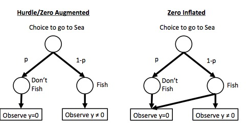

```{r setup, include=FALSE}
knitr::opts_chunk$set(echo = TRUE)
```

## 1. Gone Fishing

Today we're going to go through a data set or two to examine the process of building a model from the ground up. To begin with, we'll use a simulated data set looking at duration of offshore fishing trips in days given average wave height.

```{r load_data}
fishing <- read.csv("./data/20/fishing_duration.csv")

#what's there
head(fishing)

#visualize the data
plot(days_at_sea ~ seas_m, data=fishing)
```

## 2. Exploratory Analysis Decisions

OK, let's assume you have no a priori knowledge about this data save the variables in it. You are interested in just a bivariate relationship. Period.  
\
Now, in building a model for this, you have to decide on three things.  
\
1. What is the data generating process?  
2. What is the error generating process - the distribution of the variation around predicted values?  
3. As we're using Bayes, do we have information that can allow us to provide weakly informative priors?  

### 2.1 The data generating process

On the data generating process, we can look at the data and see, hey, we have a negative relationship, and its one that cannot be less than 0. This suggests a power or exponential relationship. An exponential (log link function) seems pretty reasonable.

### 2.2 The error generating process

This one is harder. We have made some decisions that are useful. We have no non-negative values. We have continuous data. So, no normal distribution. And no Poisson or other count distribution. But what are we left with. Log-normal? Gamma? Erlang? Weibull? Others (oh, and there are others).  

We have a few options - we can plot histograms, plot densities at each predictor value (or bin of predictor), we can fit a gaussian model, know that it's wrong but look at its residual distribution, we can stare at our scatterplot and ponder.  

What we're pondering is *histomancy* - the mystic ability to divine distributions from a histogram or density plot.  

It is a terrible idea.  

Instead, let's actually use science and some thought. In this case, we're looking at a distribution of durations (days at sea). There's some underlying thing that determines the duration that someone stays at sea. This fits naturally to a Gamma distribution. Others could work here, too, but, a Gamma is also maximum entropy distribution for data from 0 to infinity where the variance increases with the mean. And a member of the exponential family, so fairly easy to work with. So, yes, you could choose others, but for biological plausibility, and ease of use, it's an excellent first choice.

#### 2.2.1 The Gamma


As a quick reminder of what the gamma is, it's a distribution that can be defined with either a shape parameter and a rate of events happening (1/time to event - in this case, the decision to port) or the same shape parameter and a scale parameter which is 1/rate (so, time for 1 event to happen). This can lead to a little bit of confusion, as you'll see it presented either way. Personally, I like rate, but either will work

So, below, as we increase the rate, we have more and more short wait times for 1 event.

```{r gamma, message=FALSE}
library(tidyr)
library(dplyr)
library(ggplot2)

gamma_frame <- crossing(rate = seq(0.1, 2, length.out=5), 
                        shape=1, 
                        x=seq(0.01, 5, length.out=200)) %>%
  mutate(d = dgamma(x, shape = shape, rate = rate))

ggplot(gamma_frame, aes(x=x, y=d, color=factor(rate))) +
  geom_line()

```

To make things a bit easier, the mean of a gamma is mu = shape * scale. This leads to a few relationships/transformations which can become useful.  

shape = mu/scale  
rate = shape/mu  
scale = mu/shape  

It's a bit of a pain, as depending on how you put things together, you can get slightly different results from models. But it should not matter to qualitative outcomes.

### 2.3 Priors

In this case, we don't really have any prior information! So we want flat priors. We can use regularization - say, b ~ dnorm(0,10), but how much depends on you. We're also going to want priors for scale or rate parameters. These can be normal, but often cauchy (for scale) or exponential (for rate) priors work well. YMMV.

### 3. Fitting with a Gamma


#### 3.1 The model
So, let's start with `dgamma`. By default, `dgamma` takes first a shape and then a rate argument. This presents a small challenge, as above we have shape = rate/mu. This means we would need to work with our mean value a bit. Rather than a straight `log(mu)` statement, we're going to need to use the calculated value.  Let's put together a model.


```{r gamma_mod, message=FALSE, warning=FALSE}
library(rethinking)

fishing_gamma_mod <- alist(
  #likelihood
  #noting that rate = shape/exp(log_mu)
  days_at_sea ~ dgamma(shape, shape/exp(log_mu)),
  
  #data generating process
  log_mu <- a + b*seas_m,
  
  #priors
  a ~ dnorm(0,100),
  b ~ dnorm(0,100),
  shape ~ dexp(2)
)
```


McElreath has also put together a shortcut, `dgamma2`, but it tends to produce slightly different results, as it calculates shape as a function of the predictors. So I'm not a yuge fan.

```{r gamma_mod_2}
fishing_gamma_mod2 <- alist(
  #likelihood
  days_at_sea ~ dgamma3(mu, scale),
  
  #data generating process
  log(mu) <- a + b*seas_m,

  #priors
  a ~ dnorm(0,100),
  b ~ dnorm(0,100),
  scale ~ dcauchy(0,2)
)
```

#### 3.2 The fit

OK, let's fit this thing using the first model!  

```{r fit_gamma, error=TRUE}
fishing_gamma_fit <- map(fishing_gamma_mod, data=fishing)
```

Uh oh! What's wrong?  

and now, we encounter mistake #1. Remember that part about using a gamma? Well.... a Gamma has another issue - it's not very good with handling zeroes! In this case, we see that there are zeroes. Places where a fisherman decided not to even leave port! Uh oh. Let's ignore those for the moment, then, and model the rest.  

```{r fit_gamma_good, error=TRUE}
fishing_clean <- fishing %>% filter(days_at_sea != 0)

set.seed(609)
fishing_gamma_fit <- map(fishing_gamma_mod, data=fishing_clean)
```

Oops! That didn't work either! Well that's not good. So, what does the error say? That start values were invalid.  OK.

Welp, eyeballing the graph of the data, we see a positive intercept and negative slope. So, even with the same seed (other seed values allow for convergence), let's re-try!

```{r fit_gamma_really_good}
set.seed(609)
fishing_gamma_fit <- map(fishing_gamma_mod, data=fishing_clean,
                         start = list(a=1, b=-1))
```

Fit!

#### 3.3 Model evaluation

Let's check out our posterior!

```{r post_normal}
pairs(fishing_gamma_fit)
```

Hey! Not bad. Indeed, I wouldn't even go to STAN with a fit like this.

```{r postcheck, error=TRUE, results="hide"}
par(mfrow=c(2,3))
postcheck(fishing_gamma_fit)
par(mfrow=c(1,1), ask=F)
```

Looking pretty good! there are one or two points outside of the predictive CI, but, eh, that's not bad considering the large number of data points we have. Worth investigating, but not losing too much sleep over.

#### 3.4 What do the results say?

We can first look at the general results

```{r precis_gamma}
precis(fishing_gamma_fit)
```

So, a decline of -0.63, or, for every 1m wave, fishermen would spend 53% less time at sea (`exp(-0.63)`). We can't say absolute days here, as this is a nonlinear function - what happens in absolute units going from 2 to 3 is different from 3 to 4. But we can judge it on a percentage scale. Try calculating it out if you don't believe it.  

We can also visualize the results

```{r fit_plot, results="hide"}
#start with a fresh data frame of predicted values
pred_df <- data.frame(seas_m = seq(0,5,length.out=200))

#OK, now get some sim and link output
sim_fishing <- sim(fishing_gamma_fit, data=pred_df)

#note, for link, we need to exponentiate
link_fishing <- exp(link(fishing_gamma_fit, data=pred_df))

#smoosh it all together
pred_df <- pred_df %>%
  mutate(days_at_sea = apply(link_fishing, 2, median),
         lwr_fit = apply(link_fishing, 2, HPDI)[1,],
         upr_fit = apply(link_fishing, 2, HPDI)[2,],
         lwr = apply(sim_fishing, 2, HPDI)[1,],
         upr = apply(sim_fishing, 2, HPDI)[2,]
         )

#a nice ggplot
ggplot(data=pred_df,
       mapping=aes(x=seas_m, y=days_at_sea)) +
  geom_ribbon(mapping=aes(ymin=lwr, ymax=upr), alpha=0.4) +
  geom_ribbon(mapping=aes(ymin=lwr_fit, ymax=upr_fit), fill="blue", alpha=0.4) +
  geom_line(lwd=1, color="red") +
  geom_point(data=fishing_clean) +
  theme_bw(base_size=17)
```

Not bad. We can see the results of a Gamma distribution - the mean variance scaling relationship. We can see we have some outliers to inspect, but, overall, pretty darned good.

## 4. About those Zeroes - Zero Augmented Gamma


### 4.1 Zero Inflation, augmentation, hurdles, and more

Excessive zeroes are not something to be scared of. Of which to be scared? Whatever, you guys know this on a deep level. Because a zero inflated or zero augmented distribution is nothing more than the lovechild of a binomial logistic regression and a GLM of your own choosing.

Let's start by thinking about a Hurdle or Zero Augmented model. In these models, you cannot have any zeroes in your resulting distribution. Zeroes are generated by one process, then another process determines the relationship with your response variable. So, you first split your model into one where you have either 0 or non-0 outcomes, and perform a logistic regression. With whatever predictors you want. Then, with all of the non-zero outcomes, you perform whatever GLM you want.

A Zero Inflated or Zero Augmented model is slightly different. Here, zeroes are generated either by some process that is binary - a thing happened or it didn't - OR they are generated by whatever  data generating process you are modeling.



Zero Inflated models come in many forms - Zero Inflated Poisson (uses `dzipois(lambda, p)` in rethinking), Zero Inflated Binomial (uses `dzibinom(p_zero, size, p)`), Zero Augmented Gamma (`dzagamma2(prob, mu, scale)`) and more which can be pulled from other libraries in R.

### 4.2 How do I know if it is zero inflated 

There are two straightforward ways to see if something is zero inflated. First, what's the distribution look like? Do you see a lot of zeros?

```{r zdens}
plot(density(fishing$days_at_sea))
```

OK - lots of zeroes - which, given that this is a Gamma, is super suspect. But, for this or other distributions, they might be OK. Sometimes you'll even see two humps - one around zero, one somewhere else. Zero Inflation!

You can also look at a scatterplot and see if there are a suspicious number of zeroes across all of the values of a predictor variable. Sure, you might ahve a non-normal distribution, but that kind of pattern is a bit odd.

```{r full_scatter}
plot(days_at_sea ~ seas_m, data=fishing)
```

### 4.3 Using the ZAG

To work with our original data - zeroes and all - we can use a Zero Augmented Gamma Distribution. I'm still not a huge fan of `dzagamma2` so let's make our own using the rate formulation. To do this, I literally just entered `dzamma2` in R, then rewrote the function a bit to use the rate formulation.

```{r dzagam}

dzagamma <- function (x, prob, shape, rate, log = FALSE) 
{
  K <- as.data.frame(cbind(x = x, prob = prob, shape = shape, rate = rate))
  llg <- dgamma(x, shape = shape, rate = rate, log = TRUE)
  ll <- ifelse(K$x == 0, log(K$prob), log(1 - K$prob) + llg)
  if (log == FALSE) 
    ll <- exp(ll)
  ll
}
```

Let this be a less - you can put in whatever density function you want - if R doesn't have it, write your own! Heck, this format is a really straightforward way to turn any distribution - normal, whatever - into a zero inflated distribution.

In this distribution, we'll have a lot of extra 0s. What's great is that we can appropriate our earlier model for use here.

```{r zag_mod}
fishing_zagamma_mod <- alist(
  #likelihood
  #noting that rate = shape/exp(log_mu)
  days_at_sea ~ dzagamma(prob, shape, shape/exp(log_mu)),
  
  #data generating process
  log_mu <- a + b*seas_m,
  
  #priors
  a ~ dnorm(0,100),
  b ~ dnorm(0,100),
  shape ~ dexp(2),
  prob ~ dunif(0,1)
)
```

We have no info on the probability, so, we're just putting in a flat uniform prior between 0 and 1. We could use a beta if we wanted, but, meh. We can then fit this, using our lessons about start values from before.

```{r zag_fit}
fishing_zagamma_fit <- map(fishing_zagamma_mod, data=fishing,
                         start = list(a=1, b=-1))
```

### 4.4 Evaluation

Let's look at those posteriors!

```{r pairs_zag}
pairs(fishing_zagamma_fit)
```

The pairs plot looks nice and well behaved. Other checks and `sim` are a bit more difficult, as they require a random number generator which we currently... don't have. So, let's make one.

```{r rzag}
rzagamma <- function(n, prob, shape, rate){
  is_zero <- rbinom(n, 1, prob=1-prob)
  is_zero * rgamma(n, shape, rate)
}
```

With this, we can use postcheck

```{r postcheck_zag}
par(mfrow=c(3,3))
postcheck(fishing_zagamma_fit)
par(mfrow=c(1,1), ask=F)
```

Hey - it's all of the data! And it looks - good! 


#### 4.5 What do the results say?

We can first look at the general results

```{r precis_zgamma}
precis(fishing_zagamma_fit)
```

No surprise, our coefficients are exactly the same as before! Wahoo! Except now we also know there's a 30% chance on any given day that a fisherman will just say 'meh' and not go do sea.

We can also visualize the results

```{r fit, results="hide"}
#start with a fresh data frame of predicted values
pred_df_z <- data.frame(seas_m = seq(0,5,length.out=200))

#OK, now get some sim and link output
sim_fishing_z <- sim(fishing_zagamma_fit, data=pred_df_z)

#note, for link, we need to exponentiate
link_fishing_z <- exp(link(fishing_zagamma_fit, data=pred_df_z))

#smoosh it all together
pred_df_z <- pred_df_z %>%
  mutate(days_at_sea = apply(link_fishing_z, 2, median),
         lwr_fit = apply(link_fishing_z, 2, HPDI)[1,],
         upr_fit = apply(link_fishing_z, 2, HPDI)[2,],
         lwr = apply(sim_fishing_z, 2, HPDI)[1,],
         upr = apply(sim_fishing_z, 2, HPDI)[2,]
         )

#a nice ggplot
ggplot(data=pred_df_z,
       mapping=aes(x=seas_m, y=days_at_sea)) +
  geom_ribbon(mapping=aes(ymin=lwr, ymax=upr), alpha=0.4) +
  geom_ribbon(mapping=aes(ymin=lwr_fit, ymax=upr_fit), fill="blue", alpha=0.4) +
  geom_line(lwd=1, color="red") +
  geom_point(data=fishing) +
  theme_bw(base_size=17)
```

It's hard to see the difference relative to the previous plot, but, if you take a gander, the scale of the predictive interval has shrunk a bit. Or, gets pulled towards zero, as it were, as we have a lot of zeroes. Makes sense!