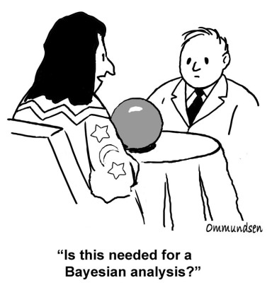

<center></center>  

  ```{r prep, echo=FALSE, cache=FALSE, message=FALSE, warning=FALSE}
library(knitr)
library(dplyr)
library(tidyr)

library(rethinking)


library(ggplot2)
#center plot titles
theme_set(theme_bw(base_size=14))
theme_update(plot.title = element_text(hjust = 0.5))

```

## 1. Moving On with Bayes

#### 1.1 The wild world of Bayes beyond R class
Well, we've had some fun. And now it's time to move onwards. Coming to the end of this class, there are a few things you'll find useful. First, some books. You're now armed enough to be able to wrestle with Gelman et al's [Bayesian Data Analaysis vol 3](https://www.amazon.com/Bayesian-Analysis-Chapman-Statistical-Science/dp/1439840954/ref=la_B001IGUSKM_1_1?s=books&ie=UTF8&qid=1493837827&sr=1-1) which is a fairly accessible intro to many many many models in the topic. Given what we've talked about, you should be able to translate to rethinking in a straightforward manner. I've also drawn very heavily on Gelman and Hill's [Data Analysis Using Regression and Multilevel/Hierarchical Models](https://www.amazon.com/Analysis-Regression-Multilevel-Hierarchical-Models/dp/052168689X/ref=pd_sim_14_1?_encoding=UTF8&pd_rd_i=052168689X&pd_rd_r=0987H65CVKHKMSFVSDHW&pd_rd_w=9FftE&pd_rd_wg=Mamaw&psc=1&refRID=0987H65CVKHKMSFVSDHW) which is SUPER useful. And likely to be updated any day now?

But what about software? We've been using the `rethinking` package which calls stan. There is a whole ecosystem of tools designed to work with Bayesian data analysis. Seriously, just check the [CRAN Bayesian taskview](https://cran.r-project.org/web/views/Bayesian.html) (which isn't even complete) (or look at [python's bayes packages](https://pypi.python.org/pypi?%3Aaction=search&term=bayes&submit=search))  

While `rethinking` is awesome in the easy access it provides to stan, there are some simpler packages, and some more complex. Let's take a look at a few of these. We'll fit one poisson regression and one variable slope-intercept model as an example in each and look at inferential tools.

#### 1.2 Our regression example
As I love this dataset, let's use the marriage-divorce rate data we began the class with. For a multiple linear regression with median marriage age and marraige rate as predictors, we built the following model, oh so long ago...

```{r waffleDivorce, message=FALSE, results="hide", cache=TRUE, warning=FALSE}
#load the data and scale predictors
library(dplyr)
library(tidyr)
library(rethinking)
data(WaffleDivorce)


wd <-  WaffleDivorce %>%
    mutate(MedianAgeMarriage_s = scale(MedianAgeMarriage)[,1],
         Marriage_s = scale(Marriage)[,1])

##our model
wd_mod <- alist(
  #likelihood
  Divorce ~ dnorm(mu, sigma),
  
  #Data Generating Process
  mu <- alpha + beta_a * MedianAgeMarriage_s + beta_r * Marriage_s,
  
  # Priors
  sigma ~ dcauchy(0,2),
  alpha ~ dnorm(0,10),
  beta_a ~ dnorm(0,5),
  beta_r ~ dnorm(0,5)
)

#fit, and time the whole shebang
wd_time <- system.time(
  wd_fit <- map2stan(wd_mod, data=wd,
                     iter=2000)
)
```


#### 1.2 Our variable slope-intercept example
Let's go with Dinosaurs here with variable slopes! We'll look at how the age-log mass relationship varies by species!

```{r dino, cache=TRUE, results="hide", warning=FALSE, message=FALSE}
data(Dinosaurs)
Dinosaurs$age_c <- Dinosaurs$age - mean(Dinosaurs$age)
Dinosaurs$log_mass <- log(Dinosaurs$mass)

#standard variable slope model
dino_mod <-  alist(
  #likelihood
  log_mass ~ dnorm(log_mu, sigma_log),
  
  #dgp
  log_mu <- a_bar + a[sp_id] + (b_bar + b[sp_id])*age,
  
  c(a,b)[sp_id] ~ dmvnorm2(0,sigma_species,Rho_species),
  
  #priors
  a_bar ~ dnorm(0,10),
  b_bar ~ dnorm(0,10),
  sigma_log ~ dcauchy(0,2),
  sigma_species ~ dcauchy(0,2),
  Rho_species ~ dlkjcorr(4)
)

#fit and time!
dino_time <- system.time(
  dino_fit <- map2stan(dino_mod, data=Dinosaurs,
                        iter=4000, chains=3)
)
```

## 2. `rstanarm`

#### 2.1 Package intro and our linear model
The `rstanarm` package was released by the [stan](http://mc-stan.org) development team and meant to be an easy way for more r-izens to interface with stan. It basically takes the complexity of working with stan away, and allows folk to use the same functions they're used to, but in a bayesian framework, by appending `stan` to them. It also provides precompiled models that are fairly efficient, in order to enable fast fitting. For example, for the divorce multiple regression model, we could fit it with:

```{r rstanarm_glm, message=FALSE, warning=FALSE, results="hide"}
library(rstanarm)

rstan_wd_time <- system.time(
  wd_arm <- stan_glm(Divorce ~ MedianAgeMarriage_s + Marriage_s, data=wd,
                           iter=2000, chains=1)
)
```

To give you a sense of the speed boost
```{r}
wd_time
rstan_wd_time
```

Daaaamn. Yeah, compiling a model can take a while.

#### 2.2 Mixed Model

Similarly, our mixed model uses a call very similar to `lmer`

```{r arm_lmer, results="hide", warning=FALSE, cache=TRUE}
dino_arm_time <- system.time(
  dino_arm <- stan_lmer(log_mass ~ age + (1 + age | species), data=Dinosaurs,
                        iter=4000, chains=3)
)
```

Not as much of an obvious spedbump, but...not bad. Mixed models are hard.

```{r compare_dino_time}
dino_time
dino_arm_time
```

#### 2.3 Priors

`rstanarm` lets you customize your priors. There are defaults, largely following the recommendations of [the STAN prior choice wiki](https://github.com/stan-dev/stan/wiki/Prior-Choice-Recommendations). But, some details.

First, you'll note that we did not use `stan_lm`. Why? That's because the priors for `stan_lm` puts a prior on it's [R<sup>2</sup>](https://github.com/jgabry/R2prior/blob/master/R2prior.pdf). There are some good reasons for this, and I'll leave it to you to check out `?priors` to read more. If you are merely fitting a linear model, this is going to speed up things immensely. `stan_lm` also sets a normal prior on the intercept, with the default behaviour of N(0, sd(y)/n).

`stan_glm` takes priors in a manner we're more comfortable with. The slope priors default to N(0,2.5) and the intercept N(0,10). For slopes, specifying one prior will set the prior for all of those parameters. Supply a vector if you want separate priors for each slope.  We might want to change these - for example

```{r change_prior, warning=FALSE, results="hide"}
wd_arm_priors <- stan_glm(Divorce ~ MedianAgeMarriage_s + Marriage_s, data=wd,
                           iter=2000, chains=1,
                   prior = normal(0,100), prior_intercept = normal(0,100))

#let's compare the models
compare(waic(wd_arm_priors), waic(wd_arm))
```

the `stan_lmer` and `stan_glmer` (for glmmms) priors work similarly, only there is an additional argument for a covariance matrix, `decov`. This works similarly to the `LKJ` prior but can contain some additional information for a more flexible prior if needed. 

#### 2.4 Inference
##### 2.4.1 Model Checking
There are a lot of ways we can check `rstanarm` models. Indeed, if you don't want to code it, you can just use `shinystan` to look at your model in a web browser. Try it out!

We can assess convergence using plot with the plotfun `stantrace`
```{r rstanarm_plot, results="hide"}
plot(wd_arm, plotfun = "stan_trace")
```

There are a variety of other `plotfun` arguments we could use, like density, or we can look at autocorrelation
```{r rstanarm_converge, results="hide"}
plot(wd_arm, show_density = TRUE)
plot(wd_arm, plotfun = "stan_ac")
```

There are a lot of other checks. We can look at the general distribution of our observations versus those of the fit model:

```{r rstanarm_check}
rstanarm::pp_check(wd_arm)
```

We can also look at the distribution of residuals

```{r rstanarm_check_resid}
rstanarm::pp_check(wd_arm, check="residuals")
```

Or a number of other comparisons to statistics that look like our observations

There's no check similar to `postcheck` currently. But we can make one using `posterior_predict`, which functions like `sim`. `predict` can work like link, but does not produce samples. 

```{r postcheck_arm}
obs_samp <- rstanarm::posterior_predict(wd_arm)
obs_vals <- data.frame(fit = apply(obs_samp, 2, median),
                       lwr = apply(obs_samp, 2, HPDI)[1,],
                       upr = apply(obs_samp, 2, HPDI)[2,],
                       x = 1:ncol(obs_samp),
                       obs = wd$Divorce)

ggplot(obs_vals, aes(x=x, y=fit)) +
  geom_point(shape=1) +
  geom_point(shape = 3, mapping=aes(y=lwr)) +
  geom_point(shape = 3, mapping=aes(y=upr)) +
  geom_point(shape = 19, mapping=aes(y=obs))
```

I'm guessing you can come up with slightly better visualizations here.

##### 2.4.1 Model Evaluation
We can evaluate the model as usual - `summary` not `precis`. Let's compare `rethinking` and `rstanarm`. I'll specify the CLs we're interested in to make the output more comparable.

```{r summary_arm}
summary(wd_fit)

summary(wd_arm, digits=2, probs = c(0.11, 0.89))
```

Quite similar, modulo some rounding error.


```{r summary_arm_mixed}
summary(dino_fit)

summary(dino_arm, digits=2, probs = c(0.11, 0.89))
```

Again, pretty similar. We can see that `rstanarm` was somewhat more efficient - not totally surprising.

#### 2.5 Prediction

As outlined above, we can get predictions from our full posterior fairly easily. If we want to drill down more - say to get link predictions, we'd need to extract samples. This is surprisingly easy, as instead of a complex list, `rstanarm` and anything fit by `rstan` gives you their posterior as a matrix. So, we can use this matrix to, say, look at the effect of changing median marriage age at the aveage marriage rate.

```{r make_pred, results="hide", message=FALSE}
#first, in rethinking
pred_df <- data.frame(MedianAgeMarriage_s = seq(-3,3,length.out=200),
                      Marriage_s = 0)
wd_link <- link(wd_fit, pred_df)
wd_sim <- sim(wd_fit, pred_df)


pred_df_rethinking <- mutate(pred_df, Divorce = apply(wd_link, 2, median),
                  lwr_link = apply(wd_link, 2, HPDI)[1,],
                  upr_link = apply(wd_link, 2, HPDI)[2,],
                  lwr_sim = apply(wd_sim, 2, HPDI)[1,],
                  upr_sim = apply(wd_sim, 2, HPDI)[2,])

pred_rethink <- 
  ggplot(data=pred_df_rethinking, mapping=aes(x=MedianAgeMarriage_s, y=Divorce)) +
  geom_ribbon(mapping=aes(ymin=lwr_sim, ymax=upr_sim), fill="grey") +
  geom_ribbon(mapping=aes(ymin=lwr_link, ymax=upr_link), fill="darkgrey") +
  geom_line(color="red") +
  geom_point(data=wd) + ggtitle("rethinking")

#now with rstanarm
#using transpose to make things the same
#orientation as from rethinking
wd_samp <- as.matrix(wd_arm)

wd_link_arm <- t(apply(wd_samp, 1, function(arow) arow[1] +
                       arow[2]*pred_df$MedianAgeMarriage_s))

wd_sim_arm <- rstanarm::posterior_predict(wd_arm, newdata=pred_df)

pred_df_arm <- mutate(pred_df, Divorce = apply(wd_link_arm, 2, median),
                  lwr_link = apply(wd_link_arm, 2, HPDI)[1,],
                  upr_link = apply(wd_link_arm, 2, HPDI)[2,],
                  lwr_sim = apply(wd_sim_arm, 2, HPDI)[1,],
                  upr_sim = apply(wd_sim_arm, 2, HPDI)[2,])

pred_arm <- 
ggplot(data=pred_df_arm, mapping=aes(x=MedianAgeMarriage_s, y=Divorce)) +
  geom_ribbon(mapping=aes(ymin=lwr_sim, ymax=upr_sim), fill="grey") +
  geom_ribbon(mapping=aes(ymin=lwr_link, ymax=upr_link), fill="darkgrey") +
  geom_line(color="red") +
  geom_point(data=wd) + ggtitle("rstanarm")

library(gridExtra)
grid.arrange(pred_rethink, pred_arm, ncol=2)
```

#### 2.6 Whither `map`

`rstanarm` does provide an opportunity to use an optimizer instead of stan. So, compare the following. Note, I'm specifying the map method to make sure that they are using the same algorithm.

```{r map_arm, results="hide"}
wd_map <- map(wd_mod, data=wd, method="L-BFGS-B",
              lower = list(sigma=0.01))

wd_arm_optim <- stan_glm(Divorce ~ MedianAgeMarriage_s + Marriage_s, data=wd,
                         algorithm = "optimizing")

precis(wd_map)
summary(wd_arm_optim)
```

I'll leave it to you to go from there. The speed advantage, given pre-compilation, is no longer as substantial, but it can be nice.

## 3. `brms`
#### 3.1 Package Intro and our Models
`brms` is a fracking amazing package. It's amazing because, syntactically, it shares a lot in common with `rstanarm`. But, models are compiled before running. And so, the wonderful developer of the package has decided to take the swiss-army-knife approach, and is, daily, adding new customizations to `brms` to allow it to do any number of complex models, all with a fairly simple (relative to `rethinking` or `stan` formulation.) It's worth following the [issue tracker](https://github.com/paul-buerkner/brms/issues) to see what gets added to the dev version and when new stable ones are released.

So, what does our simple linear regression model look like? Not really any different from our `rstanarm` version.

```{r brm_lm, message=FALSE, results="hide", cache=TRUE}
library(brms)

wd_brm_time <- system.time(
  wd_brm <- brm(Divorce ~ MedianAgeMarriage_s + Marriage_s, data=wd,
                           iter=2000, chains=1)
)
```

Nor does our mixed model. It again uses `lme4`-like sytax.

```{r brm_lme, message=FALSE, results="hide", cache=TRUE}
dino_brm_time <- system.time(
  dino_brm <- brm(log_mass ~ age + (1 + age | species), data=Dinosaurs,
                        iter=4000, chains=3)
)
```

#### 3.2 Priors
```{r brms_propr}
prior_wd <- c(set_prior("normal(0,5)", class="b", coef="MedianAgeMarriage_s"),
                        set_prior("normal(0,5)", class="b", coef="Marriage_s"))
wd_brm_prior <- brm(Divorce ~ MedianAgeMarriage_s + Marriage_s, data=wd,
                    prior = prior_wd)
```
#### 3.3 Inference
##### 3.3.1 Model Checking
##### 3.3.1 Model Evaluation
#### 3.4 Prediction
#### 3.5 More Fanciness From This Package

## 4. `inla`
#### 4.1 Package Intro and our Linear Model
```{r wd_inla}
library(INLA)

wd_inla <- inla(Divorce ~ MedianAgeMarriage_s + Marriage_s, data=wd)
```

#### 4.2 Mixed Model
```{r dino_inla}
Dinosaurs$species2 <- Dinosaurs$species
dino_inla <- inla(log_mass ~ age + f(species, model="iid") + f(species2, age), data=Dinosaurs)
```
#### 4.3 Priors
#### 4.4 Inference
##### 4.4.1 Model Checking
##### 4.4.1 Model Evaluation
#### 4.5 Prediction
#### 4.6 More Fanciness From This Package

## 5. stan via `rstan`
#### 5.1 Package Intro and our Linear Model
##### 5.1.1 The Stan Language
##### 5.1.2 A Linear Model
#### 5.2 Mixed Model
#### 5.3 Priors
#### 5.4 Inference
##### 5.4.1 Model Checking
##### 5.4.1 Model Evaluation
#### 5.5 Prediction
#### 3.6 More Fanciness From This Package